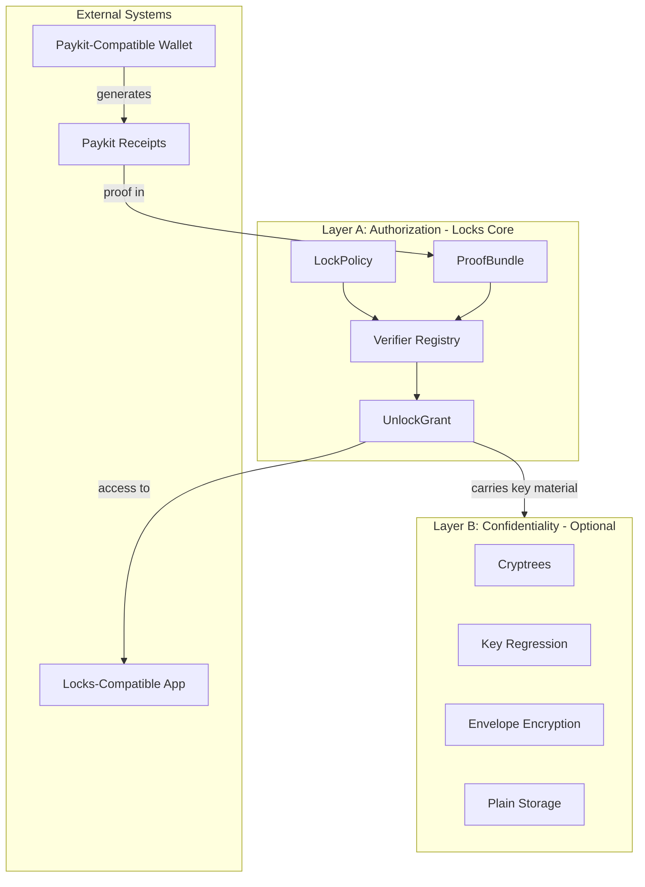

# Pubky Locks

**Pubky Locks** is an authorization layer that enables commerce for content, subscriptions, memberships, and digital goods in the Pubky ecosystem. It bridges any Paykit-compatible wallet (e.g., Bitkit) with Locks-compatible apps (e.g., Pubky App) through a standardized receipt and grant protocol.

This document serves as both the specification and implementation plan, validated against:

- [PUBKY_CRYPTO_SPEC.md](pubky-core/docs/PUBKY_CRYPTO_SPEC.md) v2.4 (source of truth for cryptography)
- [pubky-noise](pubky-noise/) (sealed_blob.rs, kdf.rs, identity_payload.rs)
- [paykit-rs](paykit-rs/) (PaykitReceipt, ProofVerifierRegistry, subscriptions)
- [pubky-locks-master-plan-v1.md](pubky-locks-master-plan-old.md) (original specification)

---

## Borrowed Standards and Profiles (Minimal)

Locks intentionally reuses proven standards where they reduce interop bugs without changing the Pubky model:

- JSON canonicalization: JCS ([RFC 8785](https://www.rfc-editor.org/rfc/rfc8785)) for all signed JSON objects.
- Optional future binary profile (not MVP): deterministic CBOR ([RFC 8949](https://www.rfc-editor.org/rfc/rfc8949.html) Section 4.2) with COSE ([RFC 9052](https://www.rfc-editor.org/rfc/rfc9052)).

Locks also supports optional *grant profiles* for advanced delegation in later phases:
- Core: UnlockGrant (JSON+JCS, signed with Pubky/Ed25519).
- Optional (Phase 5): serialize UnlockGrant semantics into Biscuit or [UCAN](https://ucan.xyz/delegation/)-style delegation/invocation formats when delegation/attenuation is required.

---

## What Pubky Locks Does

Locks is **NOT** a payment protocol. It doesn't process funds. It only **verifies proofs** that payments (or other conditions) were satisfied, then issues short-lived access grants.

**Supported Lock Types:**
- **Payment** - Pay sats via any Paykit-compatible wallet
- **Password** - Enter a secret passphrase
- **Tag/Membership** - Hold a signed credential (e.g., "gold member")
- **Time Window** - Access only during specific periods
- **Puzzle** - Solve a computational challenge
- **Contract** - Multi-party signature agreement

---

## How It Works for Users

### Creator Flow (Alice wants to sell a post)

1. Alice creates a **LockPolicy** specifying conditions (e.g., "pay 50,000 sats OR enter password")
2. Policy is stored at `/pub/pubky.app/locks/policies/{lock_id}.json`
3. Alice's content is now gated

### Viewer Flow (Bob wants to access)

1. Bob tries to access content → gets **402 Payment Required** with policy link
2. Bob sees price (50,000 sats) and taps "Pay"
3. Locks-compatible app opens a Paykit-compatible wallet via deep link or intent
4. Bob pays, wallet generates a **PaykitReceipt** (cryptographic proof)
5. Wallet calls back to requesting app with receipt
6. App bundles receipt into **ProofBundle**, submits to `POST /.well-known/locks/verify`
7. Homeserver verifies proof, issues **UnlockGrant** (short-lived access token)
8. Bob views content by presenting the grant

---

## Trust Model

### What IS Trusted

| Component | Trust Requirement | Why |
|-----------|------------------|-----|
| Creator's Homeserver | Trusted to verify honestly | Runs verifiers, issues grants, sees access patterns |
| Grant Issuers | Must be whitelisted in policy | Only `authorized_grant_issuers` can mint valid grants |
| Paykit Receipt Integrity | Cryptographically signed | Homeserver validates but must do so correctly |

### What IS NOT Trusted (with optional Layer B)

| Component | No Trust Needed | Why |
|-----------|-----------------|-----|
| Content Storage | Optional, via Cryptrees | Content can be end-to-end encrypted |
| Key Material | Delivered via Noise sessions | Encrypted keys travel through secure channels |

### The Honest Gatekeeper Model

The homeserver is an **honest gatekeeper**:
- Verifies proofs correctly (trusted behavior)
- Issues grants only when policy is satisfied (trusted behavior)
- Could theoretically lie about verification (attack vector)

**Mitigations:**
1. **Policy is signed by creator** - Rogue server can't change policy without invalidating signature
2. **Grants reference policy_hash** - Clients verify grant matches policy
3. **Audit logs** - Homeserver stores verification trails
4. **Portability** - Users can migrate homeservers

---

## Tradeoffs and Limitations

### 1. No Atomic Payment-Delivery Guarantee

The system is **best-effort, not atomic**:
- Pay first, then get grant
- Server crash between payment and grant issuance requires retry
- **Mitigation**: Idempotency store ensures same receipt returns same grant

### 2. Password Locks Are Inherently Weak

- Password hash is in the public policy (brute-forceable)
- Rate limiting (5 attempts/15min, then 1 hour lockout) helps
- Only suitable for low-stakes content

### 3. Bearer vs PoP Grants

| Mode | Pros | Cons |
|------|------|------|
| Bearer | Simple, just present token | Stolen grant = stolen access |
| PoP (Proof-of-Possession) | Requires viewer signature per request | More complex, but stolen grants are worthless |

**Recommendation**: PoP mode for anything valuable.

### 4. Short-Lived Grants

Grants have TTL (default ~1 hour):
- **Pro**: Reduces window for stolen grants
- **Con**: Users must re-verify or refresh
- **Mitigation**: Auto-refresh when 10% TTL remaining

### 5. Confidentiality Is Optional

Base system (Layer A) provides **authorization** but not **encryption**:
- Content at rest can be plaintext (homeserver can read it)
- For true zero-trust, use Layer B (Cryptrees)

---

## Deployment Architecture Options

The current pubky-homeserver is designed to be "dumb" - a simple file server with session-based auth and capability checks. Locks requires significant new capabilities. Two deployment options are available:

### Option A: Extend pubky-homeserver (Integrated)

Add Locks directly to the homeserver codebase:

```
pubky-homeserver/
  src/
    client_server/
      routes/
        tenants/          # existing file ops
        locks/            # NEW: verify, refresh, policy endpoints
          mod.rs
          verify.rs
          refresh.rs
      layers/
        authz.rs          # existing capability check
        locks.rs          # NEW: grant verification middleware
    persistence/
      locks/              # NEW: idempotency store, audit logs
        idempotency.rs
        audit.rs
```

**Pros:**
- Single deployable unit
- Shared database/state
- Simpler operations

**Cons:**
- Increases homeserver complexity significantly (~2x codebase)
- Tight coupling between storage and authorization
- Homeserver becomes "smart"

**New Dependencies on Homeserver:**

| Requirement | Current Support | Change Needed |
|-------------|-----------------|---------------|
| `POST /.well-known/locks/verify` | None | New endpoint + verifier logic |
| `POST /.well-known/locks/refresh` | None | New endpoint |
| Policy-aware read gating | None (reads are public) | 402 response middleware |
| Grant verification | Only cookie auth | New `PubkyGrant` header check |
| Idempotency store | None | New persistence layer |
| Rate limiting per (lock_id, viewer) | Only IP-based | Extended rate limiter |
| Verifier registry | None | Plugin system for verifiers |
| Receipt validation | None | Payment awareness |
| Ed25519 verification | Available | Use for policy/grant sigs |
| Logic AST evaluation | None | Expression evaluator |

### Option B: Separate Locks Service (Sidecar)

Deploy Locks as an independent service alongside homeserver:

```
pubky-locks-service/        # NEW standalone service
  src/
    routes/
      verify.rs
      refresh.rs
    verifiers/
      payment.rs
      password.rs
      tag.rs
    persistence/
      idempotency.rs
      audit.rs
    middleware/
      grant_check.rs

pubky-homeserver/           # Minimal changes
  src/
    client_server/
      layers/
        locks_proxy.rs      # Reverse proxy to locks-service
                            # OR: stateless header-based grant check
```

**Pros:**
- Homeserver stays dumb (minimal file server)
- Locks logic isolated and independently deployable
- Easier to test and audit
- Optional for homeserver operators who don't need commerce

**Cons:**
- Another service to run and monitor
- Inter-service communication overhead
- State coordination (idempotency, revocations)

**Communication Options:**

1. **Reverse Proxy**: Homeserver proxies `/.well-known/locks/*` to locks-service
2. **Sidecar**: Locks-service runs alongside, shares network namespace
3. **Stateless Header Check**: Homeserver only validates grant signatures (no state), locks-service handles verification

### Recommended Approach

For MVP, **Option A (Integrated)** is simpler to implement and deploy. However, the `pubky-locks` crate should be designed as a standalone library that could later be extracted into a separate service (Option B) if needed.

```
pubky-locks/                # Standalone crate (library)
  src/
    lib.rs                  # Public API
    policy.rs               # LockPolicy
    proof_bundle.rs         # ProofBundle
    grant.rs                # UnlockGrant
    verifiers/              # Verifier implementations
    logic.rs                # AST evaluator
    encoding.rs             # Canonical JSON
    error.rs                # Error types

pubky-homeserver/           # Consumes pubky-locks as dependency
  Cargo.toml                # depends on pubky-locks
  src/
    client_server/routes/locks/  # Thin HTTP layer over pubky-locks
```

This approach:
- Keeps business logic in `pubky-locks` crate (portable)
- Homeserver provides HTTP transport only
- Future extraction to standalone service is straightforward

---

## Cryptographic Foundations

### Domain Separation Constants

All cryptographic operations use domain-separated prefixes per PUBKY_CRYPTO_SPEC Appendix A:

| Operation | Domain String |

|-----------|---------------|

| LockPolicy signature | `"pubky-locks/policy/v1"` |

| ProofBundle signature | `"pubky-locks/proof-bundle/v1"` |

| UnlockGrant signature | `"pubky-locks/grant/v1"` |

| Receipt lock_commitment | `"pubky-locks/receipt-bind/v1"` |

| Policy hash | `"pubky-locks/policy-hash/v1"` |

| PoP request binding | `"pubky-locks/pop/v1"` |

| Content-key AAD | `"pubky-locks/content-key/v1:"` |

### Canonical Encoding (v1)

For v1, all signed JSON objects (LockPolicy, ProofBundle, UnlockGrant, tag credentials, revocations) MUST be canonicalized using the JSON Canonicalization Scheme (JCS), [RFC 8785](https://www.rfc-editor.org/rfc/rfc8785).

Additional Locks v1 constraints:
- Floats MUST NOT appear (integers or strings only).
- Byte arrays MUST be encoded as base64url (no padding).
- Signatures MUST be raw 64-byte Ed25519 signatures encoded as base64url (no `ed25519:` prefix).
- Unknown fields in signed objects MUST be rejected unless explicitly allowed by the schema.

Future versions MAY introduce a binary wire format using deterministically encoded CBOR ([RFC 8949](https://www.rfc-editor.org/rfc/rfc8949.html) Section 4.2) with COSE for signing/encryption ([RFC 9052](https://www.rfc-editor.org/rfc/rfc9052)), but JSON+JCS is the source of truth for v1.

### Identifier Formats

| Identifier | Format | Example |

|------------|--------|---------|

| lock_id | 32 random bytes, z-base-32 display | `8um71us...` (52 chars) |

| grant_id | 32 random bytes, z-base-32 display | `tj1igr...` (52 chars) |

| policy_hash | SHA256, hex display | `sha256:abc123...` |

| kid | first 16 bytes of SHA256(pubkey), hex | `abc123...def456` (32 chars) |

---

## Error Code Taxonomy

| Code | Category | Description |

|------|----------|-------------|

| E001 | Policy | Invalid policy signature |

| E002 | Policy | Policy expired |

| E003 | Policy | Unknown criterion type |

| E010 | Proof | Invalid proof bundle signature |

| E011 | Proof | Criterion verification failed |

| E012 | Proof | Receipt replay detected |

| E013 | Proof | Receipt binding mismatch |

| E020 | Grant | Grant expired |

| E021 | Grant | Grant issuer not authorized |

| E022 | Grant | PoP signature invalid |

| E030 | Rate | Rate limit exceeded |

---

## Storage Path Conventions

| Object | Path | Owner |

|--------|------|-------|

| LockPolicy | `/pub/pubky.app/locks/policies/{lock_id}.json` | Creator |

| Revocation List | `/pub/pubky.app/locks/revocations.json` | Creator |

| Audit Log | `/priv/pubky.app/locks/audit/{lock_id}.jsonl` | Creator (private) |

---

## Architecture Overview



---

## Phase 1: MVP - Locks Core + Paykit Bridge

**Goal:** Password + Paykit receipt unlock, enabling any Paykit-compatible wallet to unlock content in any Locks-compatible app

**Timeline:** 4-5 weeks

### 1.1 Create pubky-locks Crate Structure

Create new crate at `pubky-locks/` with modules:

- `lib.rs` - Public API and re-exports
- `policy.rs` - LockPolicy schema and signing
- `proof_bundle.rs` - ProofBundle schema and signing
- `grant.rs` - UnlockGrant schema and signing
- `logic.rs` - Logic AST evaluator (ANY/ALL/OR/NOT)
- `verifiers/mod.rs` - Verifier registry and trait
- `verifiers/payment.rs` - PaymentVerifier (wraps paykit-interactive)
- `verifiers/password.rs` - PasswordVerifier (argon2id)
- `encoding.rs` - RFC 8785 JCS canonicalization + shared encode/decode helpers
- `error.rs` - Error types including structured verification failures

### 1.2 Define Core Schemas

**LockPolicy** (from master plan Section 4.1):

- Fields: `v`, `lock_id`, `resource`, `creator`, `criteria[]`, `logic_ast`, `anti_replay`, `authorized_grant_issuers[]`, `outputs`, `sig`
- `lock_id`: 32 random bytes, displayed as z-base-32 (52 chars)
- `logic_ast` as JSON object with `op` and `args`
- `sig`: raw 64-byte Ed25519 signature, base64url encoded

**ProofBundle** (from master plan Section 4.2):

- Fields: `v`, `lock_id`, `resource`, `viewer`, `client_time`, `server_challenge?`, `proofs[]`, `sig`
- Each proof entry has `criterion_id` and `type`

**UnlockGrant** (from master plan Section 4.4):

- Fields: `v`, `grant_id`, `lock_id`, `resource`, `subject`, `mode` (bearer/pop), `rights[]`, `issued_at`, `expires_at`, `policy_hash`, `idempotency`, `outputs[]`, `issuer`, `sig`

**Verify Endpoint Response Schemas**:

```json
// Success response
{
  "status": "success",
  "grant": "<base64url UnlockGrant>",
  "grant_id": "...",
  "expires_at": 1736787700,
  "outputs": [{ "type": "access" }]
}

// Error response
{
  "status": "error",
  "error_code": "E011",
  "error": "verification_failed",
  "failed_criteria": [
    { "criterion_id": "pay", "reason": "receipt expired" }
  ],
  "passed_criteria": ["pwd"],
  "logic_result": false
}
```

### 1.3 Implement Verifier Interface

Based on pattern from [paykit-interactive/src/proof/mod.rs](paykit-rs/paykit-interactive/src/proof/mod.rs):

```rust
pub trait CriterionVerifier: Send + Sync {
    fn criterion_type(&self) -> &'static str;
    fn schema_id(&self) -> &'static str;
    async fn verify(
        &self,
        criterion: &serde_json::Value,
        proof: &serde_json::Value,
        ctx: &VerificationContext,
    ) -> CriterionResult;
}
```

### 1.4 Implement PaymentVerifier

- Wrap existing `ProofVerifierRegistry` from [paykit-interactive/src/proof/mod.rs](paykit-rs/paykit-interactive/src/proof/mod.rs)
- Validate `PaykitReceipt` structure
- Verify lock_commitment in receipt metadata using domain-separated hash:
  - `lock_commitment = SHA256("pubky-locks/receipt-bind/v1" || lock_id || resource || merchant || amount || asset)`
- Check `receipt_must_bind` requirements from policy

**LocksReceiptMetadata Schema** (in PaykitReceipt.metadata.locks):

```rust
#[derive(Serialize, Deserialize)]
pub struct LocksReceiptMetadata {
    pub lock_id: String,            // 32 bytes z-base-32 (52 chars)
    pub resource: String,           // pubky:// URI
    pub lock_commitment: String,    // "sha256:" + 64 hex chars
    pub policy_hash: Option<String>, // Optional for forward compat
}
```
```json
{
  "locks": {
    "lock_id": "8um71us...",
    "resource": "pubky://alice/pub/posts/abc123",
    "lock_commitment": "sha256:abc123..."
  }
}
```

### 1.5 Implement PasswordVerifier

- Use argon2id with params from criterion
- Implement rate limiting per (lock_id, viewer) pair
- Support optional server_challenge for replay hardening

**Rate Limit Defaults**:

| Lock Type | Limit | Window | Lockout |

|-----------|-------|--------|---------|

| Password | 5 attempts | 15 min | 1 hour |

| Puzzle | 10 attempts | 1 min | 5 min |

| Payment | No limit | - | - |

| Tag | No limit | - | - |

### 1.6 Implement Logic AST Evaluator

Evaluate JSON AST with operators:

- `ANY(args)` - at least one arg is true
- `ALL(args)` - all args are true
- `OR(args)` - any arg is true (alias for ANY)
- `NOT(arg)` - negate single arg
- `ref(criterion_id)` - leaf node referencing criterion result

### 1.7 Add Homeserver Endpoint

In [pubky-core/pubky-homeserver/src/client_server/routes/](pubky-core/pubky-homeserver/src/client_server/routes/):

**Endpoints**:

- `POST /.well-known/locks/verify` - Accept ProofBundle, return UnlockGrant or error
- `POST /.well-known/locks/refresh` - Refresh expiring grant (signed by subject)

**Locked Resource Detection**:

When accessing locked content, return 402 with headers:

```
HTTP/1.1 402 Payment Required
Lock-Policy-Url: /pub/pubky.app/locks/policies/{lock_id}.json
Lock-Id: {lock_id}
Content-Type: application/json

{
  "error": "locked",
  "lock_id": "...",
  "policy_url": "/pub/pubky.app/locks/policies/{lock_id}.json"
}
```

Note: `402 Payment Required` is the HTTP transport mapping used by pubky-homeserver; the Locks protocol itself is transport-agnostic and only requires a structured "locked" response containing `lock_id` and a policy reference.

**Grant Verification Middleware**:

- Check `Authorization: PubkyGrant <base64url-grant>` header
- For PoP mode, also check `Grant-POP: <base64url-signature>` header
- Verify grant signature, expiry, issuer authorization, and policy_hash match

**Storage Paths** (created by creator):

- Policy: `/pub/pubky.app/locks/policies/{lock_id}.json`
- Revocations: `/pub/pubky.app/locks/revocations.json`

### 1.8 Implement Idempotency Store

- Key: `H(lock_id || viewer || receipt_hash)`
- Store successful grants with expiry
- Return cached/refreshed grant on duplicate submission

### 1.9 Pubky App UX Integration

Create new files in [pubky-app/src/](pubky-app/src/):

**Services and Hooks**:

- `services/locksService.ts` - API calls, grant caching
- `hooks/useLocks.ts` - Lock state management

**Components**:

- `components/locks/LockIndicator.tsx` - Visual lock badge on content
- `components/locks/UnlockModal.tsx` - Payment/password entry UI
- `components/locks/PaymentFlow.tsx` - Wallet handoff flow
- `components/locks/GrantStatus.tsx` - Show active grants

**Features**:

- Locked content indicator (lock icon, price display)
- Display lock policy (price, accepted methods)
- Wallet handoff via deep link, intent, or QR
- Receipt import (paste or scan)
- Grant storage in localStorage with auto-refresh

**Grant Refresh Flow**:

1. Client detects grant near expiry (10% TTL remaining)
2. Client sends: `POST /.well-known/locks/refresh { grant_id, sig }`
3. Server validates original verification still valid
4. Server issues new grant with extended TTL
5. New grant has same idempotency key

### 1.10 Wallet Integration Protocol

Any Paykit-compatible wallet can integrate with Locks. The protocol uses a standard payment request format and callback mechanism.

**Deep Link Format** (wallet registers its own scheme):

```
{wallet-scheme}://pay?locks=<base64url-encoded-payment-request>

# Examples:
bitkit://pay?locks=<request>        # Bitkit
mywallet://pay?locks=<request>      # Any other Paykit wallet
```

**Payment Request Structure**:

```json
{
  "type": "pubky-locks-payment",
  "v": 1,
  "lock_id": "8um71us...",
  "resource": "pubky://alice/pub/posts/abc123",
  "amount": 50000,
  "asset": "SAT",
  "merchant": "pk:...",
  "callback": "{requesting-app-scheme}://locks/receipt?lock_id=..."
}
```

**Callback Flow**:

1. Wallet completes payment, generates PaykitReceipt
2. Wallet invokes callback URL with receipt
3. Requesting app submits ProofBundle with receipt to homeserver
4. Requesting app receives and stores UnlockGrant

**Wallet Requirements**:

To be Paykit/Locks compatible, a wallet must:
- Generate valid `PaykitReceipt` with Ed25519 signatures
- Include `LocksReceiptMetadata` in receipt metadata when `lock_id` is present in request
- Compute `lock_commitment` correctly per Section 1.4
- Support callback invocation (deep link, intent, or URL)

---

## Phase 2: Tags and Memberships

**Goal:** Membership locks, revocation, expiring credentials

**Timeline:** 3-4 weeks

### 2.1 Tag Credential Format

Ed25519-signed credential:

```json
{
  "v": 1,
  "tag": "member:gold",
  "subject": "pk:BOB",
  "issuer": "pk:ALICE",
  "issued_at": 1736784000,
  "expires_at": 1739376000,
  "sig": "ed25519:..."
}
```

### 2.2 TagVerifier

- Verify issuer signature
- Check issuer matches policy criterion
- Check expiry
- Check revocation list if referenced

### 2.3 Revocation Lists

- Policy references revocation source URL
- Format: JSON array of revoked tag hashes
- Cached with TTL

### 2.4 Subscription Integration

- paykit-subscriptions `SignedSubscription` can produce tag credentials
- Verifier checks subscription validity via tag

### 2.5 Tag Endpoints (Optional)

- `POST /.well-known/locks/tags/issue`
- `POST /.well-known/locks/tags/revoke`

---

## Phase 3: Extended Verifiers

**Goal:** Expand lock types

**Timeline:** 4 weeks

### 3.1 PuzzleVerifier

- Deterministic KDF proof (e.g., scrypt with target difficulty)
- Proof includes: solution, transcript, iterations

### 3.2 TimeVerifier

- Check `client_time` against policy `after` / `before` bounds
- Optional server time validation

### 3.3 ContractVerifier

- Multi-party signature verification
- Policy lists required signers
- Proof includes all signatures over contract hash

### 3.4 GeoVerifier (Deferred)

- Requires credible device attestation story
- Design but do not implement in this phase

---

## Phase 4: Confidentiality Layer

**Goal:** Zero-trust content protection

**Timeline:** 6 weeks

### 4.1 Cryptree Client Library

Based on [3. Pubky with Cryptrees.md](design doc):

- BaseKey, ParentKey, DataKey derivation
- Virtual file system assembly
- Lazy revocation

### 4.2 UnlockGrant content-key Output

**Output Schema** (with key_version for Ring integration):

```json
{
  "type": "content-key",
  "scheme": "cryptree",
  "scope": { "path_prefix": "/priv/posts/abc123/" },
  "kid": "abc123...def456",
  "key_version": 3,
  "encrypted_key": "b64:...",
  "enc": { "type": "noise_session", "session_id": "..." }
}
```

**AAD Construction** (per PUBKY_CRYPTO_SPEC Section 7.5):

```
aad = "pubky-locks/content-key/v1:" || grant_issuer_peerid || grant_id || recipient_peerid
```

### 4.3 Noise Key Delivery

Using [pubky-noise](pubky-noise/) (NoiseClient, NoiseServer, sealed_blob):

- Establish authenticated XX or IK session per PUBKY_CRYPTO_SPEC Section 6
- Deliver encrypted key material via Sealed Blob v2
- Session binding in grant via session_id
- Key derivation follows PUBKY_CRYPTO_SPEC Section 4.4 with key_version

### 4.4 Key Regression Output Mode

For subscription content:

- Deliver `member_state` (stmX) in grant outputs
- Client derives content keys locally

---

## Phase 5: Advanced Commerce

**Goal:** Delegation, marketplaces, affiliates

**Timeline:** 4 weeks

### 5.1 Biscuit Adapter

- Serialize UnlockGrant as Biscuit token
- Use Pubky keypairs (Ed25519 compatible)
- Add facts from grant fields

### 5.2 Delegation Patterns

- Marketplace attenuation: restrict rights, add conditions
- Affiliate tokens: track referral in facts
- Checkout tokens: time-limited purchase capability

### 5.3 Third-Party Verifier Facts

- Policy can allowlist external verifiers
- Verifier signs facts that are included in grant

### 5.4 UCAN Profile (Optional, Not MVP)

[UCAN](https://ucan.xyz/delegation/) can be supported as an optional profile for advanced delegation and invocation semantics (marketplaces, affiliates), without changing the Locks core primitives.

- UnlockGrant remains the core semantic object.
- A UCAN profile MAY encode equivalent delegation and an invocation-style PoP flow for requests.
- This is explicitly out of scope for MVP and only considered if/when delegation requirements exceed the simple UnlockGrant model.

---

## Integration Points

| Component | Existing Code | Integration |

|-----------|---------------|-------------|

| PaymentVerifier | `paykit-interactive/src/proof/mod.rs` | Wrap ProofVerifierRegistry |

| LocksReceiptMetadata | `paykit-interactive/src/lib.rs:33` (metadata field) | Add locks schema |

| Sealed Blob | `pubky-noise/src/sealed_blob.rs` | Use for content-key encryption |

| KDF | `pubky-noise/src/kdf.rs` | Follow HKDF patterns |

| Signing | `paykit-subscriptions/src/signing.rs` | Follow Ed25519 patterns |

| Noise sessions | `pubky-noise/src/client.rs`, `server.rs` | Use for key delivery |

| Homeserver routes | `pubky-core/pubky-homeserver/src/client_server/routes/` | Add locks endpoints |

| App services | `pubky-app/src/services/` (example) | Add locksService (pattern for any Locks-compatible app) |

---

## Testing Requirements

From master plan Section 14:

- Test vectors for canonical JSON encoding and signatures
- Test vectors for policy_hash computation
- Test vectors for receipt binding commitments (lock_commitment)
- Test vectors for logic_ast evaluation
- Fuzz parsers for logic_ast and schema validation
- Strict unknown field rejection tests
- Test vectors proving RFC 8785 JCS canonicalization produces identical bytes across implementations before signing/verifying

**Test Vector Format** (matching PUBKY_CRYPTO_SPEC style):

```json
{
  "test_id": "locks-policy-sign-001",
  "description": "LockPolicy signature verification",
  "inputs": {
    "policy_json": "...",
    "signing_key_hex": "...",
    "domain": "pubky-locks/policy/v1"
  },
  "expected": {
    "policy_hash_hex": "...",
    "signature_hex": "..."
  }
}
```

---

## Resolved Items (from Review)

The following items from the original plan have been resolved:

1. **Identifier encoding**: Use z-base-32 (52 chars) for lock_id/grant_id, matching PKARR identity format
2. **PKARR discovery**: MVP uses in-band discovery via 402 response + Lock-Policy-Url header
3. **Audit log schema**: Defined in Storage Path Conventions section
4. **Rate limit configuration**: Defined in Section 1.5 (5 attempts/15min for passwords)
5. **Grant refresh flow**: Defined in Section 1.9 (POST /.well-known/locks/refresh)
6. **Domain separation**: Defined in Cryptographic Foundations section
7. **Error codes**: Defined in Error Code Taxonomy section
8. **Storage paths**: Defined in Storage Path Conventions section
9. **LocksReceiptMetadata**: Defined in Section 1.4
10. **Wallet integration protocol**: Defined in Section 1.10

---

## Documentation Deliverables

Create these supplementary documents in `pubky-locks/`:

1. **LOCKS_WIRE_FORMAT.md** - JSON encoding rules, future binary format spec
2. **LOCKS_ERROR_CODES.md** - Complete error taxonomy with examples
3. **LOCKS_TEST_VECTORS.md** - Interoperability test cases
4. **LOCKS_WALLET_INTEGRATION.md** - Guide for Paykit-compatible wallet developers
5. **LOCKS_APP_INTEGRATION.md** - Guide for Locks-compatible app developers

---

## Notes

- **Backup/Restore**: Grants are ephemeral; after device restore, user must re-verify
- **Breaking Changes**: Acceptable since no production code exists yet
- **kid Length**: Use 16 bytes per PUBKY_CRYPTO_SPEC (update sealed_blob.rs from 8 to 16)