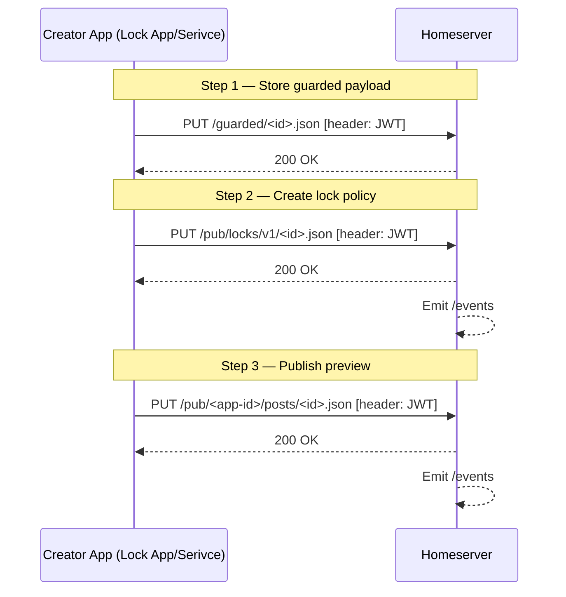
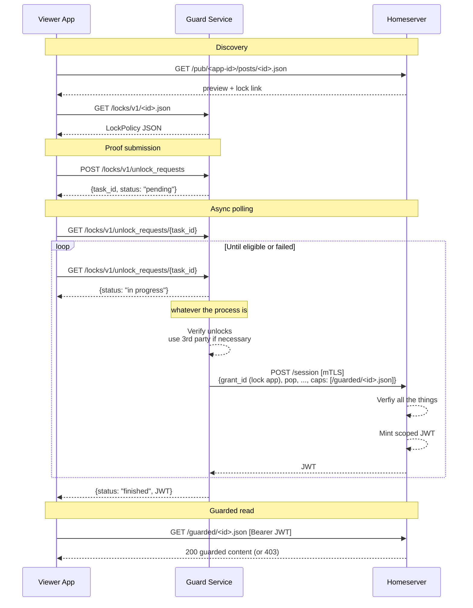
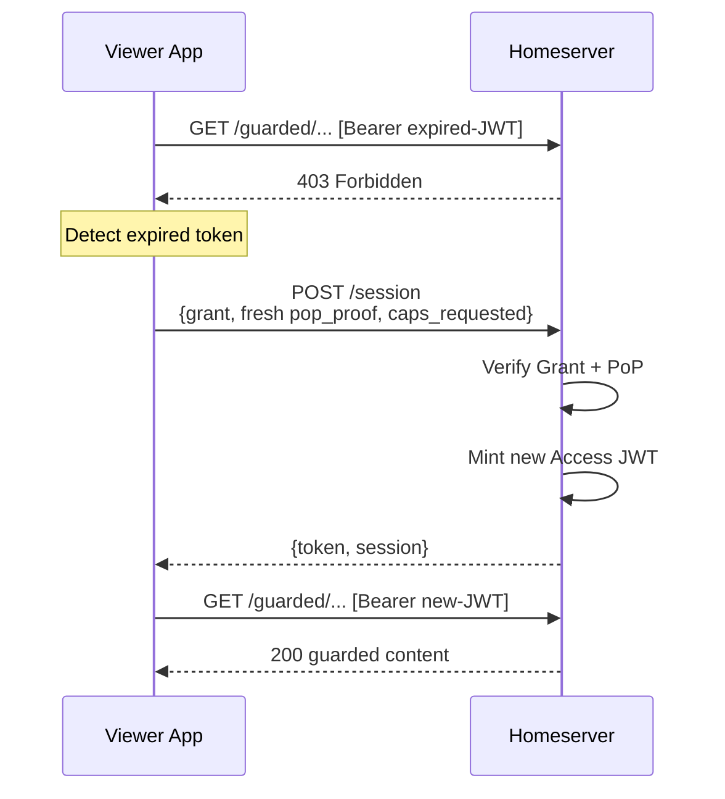
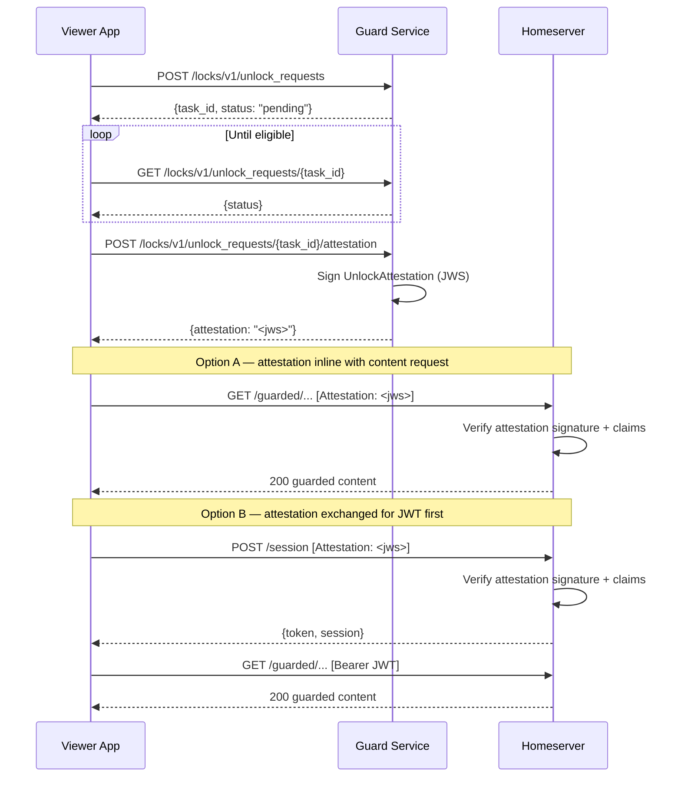

# Pubky Locks: Developer Onboarding Brief

**Version**: 0.3  
**Date**: April 8, 2026  
**Status**: Draft  
**Author**: John Carvalho / Synonym

---

## 1. What is Locks // REVIEW

Locks is the content gating application for the Pubky ecosystem. Content creators attach criteria like payment, password, or any future proof types to their content. Viewers satisfy those criteria and receive an access to the guarded content.

Locks does not custody funds or contnet. It does not replace Pubky homeserver or access control managemnt. It does not  provide DRM. Locks extend homeserver authorization with lock-aware verification through a guard service that attests viewer eligibility.

Locks described in this proposal is a service that allows content viewers to retreive homeserver issues JWT token for access of guarded content in exchange of successfully verified proof of matching lock criteria provided by the integrated third party. 

**Non-goals:**

- Payment processing or custody
- Replacing base homeserver auth/session infrastructure
- Trustless enforcement or universal DRM
- Encrypted delivery (deferred to a future layer)
- Signed lock policies (deferred)

---

## 2. Glossary // REVIEW

| Term | Definition |
|---|---|
| **Ring** | Secure key management component; signs Grants on behalf of the user |
| **Grant** | Long-lived JWS signed by user's Ed25519 key, authorizing an app with capability scopes and a `cnf` key binding |
| **PoP** | Proof of Possession — fresh JWS signed by the app's Ed25519 key, proving the client holds the key bound in the Grant's `cnf` claim |
| **Homeserver** | User's data server; stores content, enforces capabilities, mints JWT access tokens |
| **Guard Service** | Verification service co-located with the creator app domain; verifies unlock criteria and signs attestations |
| **Lock Policy** | Public object defining criteria required to access a guarded resource |
| **UnlockAttestation** | Guard-signed JWS proving a specific viewer is eligible for a specific lock |
| **UnlockTask** | Async state machine tracking verification progress for an unlock attempt |
| **ProofBundle** | Viewer-submitted proofs or proof references for an unlock attempt |
| **Capability (cap)** | Scoped permission string in a JWT session (e.g., `/guarded/<path>:r`) |
| **pkarr** | DNS-like resolution layer for Pubky identities |
| **z32** | Base32 encoding for Pubky public keys |
| **mTLS** | Mutual TLS; guard and homeserver authenticate each other's certificates |
| **JWS** | JSON Web Signature (compact serialization) |
| **JWT** | JSON Web Token; short-lived bearer token for API access |

---

## 2. Flow: Creator Publishing

> TODO: add signup into homeserver for the Creator App/Service

> Note: for the best UX we basically need atenuation here, so auth needs to be extended:
> - Payload of `POST /session` needs to accept optional `caps: []` property.
> - The value of `caps` should be subset of `caps` in **Grant** (validated by homeserver)
> - Otherwise we will need to issue grant for each locked content



**Step 1 - Store content:**

Same storing any other blob data 

**Step 2 — Lock policy creation:**

> Lock should be self contained. Meaning that only lock data should be sufficient to unlock and to verify against unlock id

```json
PUT <homeserver>/locks/v1/<id>.json

{
  "resource_guarded": "pubky<creator_z32>/guarded/<id>.json",
  "criteria": [
    {
      "id": "crit_1",
      "type": "payment",
      "params": { "amount": "50000", "asset": "BTC", "provider": "lightning" } // FIXME "provider" value 
    }
  ],
  "logic": { "op": "ALL", "criteria_ids": ["crit_1"] },
  "token_ttl_sec": 3600,
  "guard_service_id": "pubky<guard_z32>",
}
```

**Step 3 — Preview metadata with lock signal:**

Same as any post on given app

The content should include link to lock
`<homeserver>/locks/v1/<id>.json`


---

## 5. Flow 2: Viewer Unlock



**Proof submission request:**

```json
POST <guard>/locks/v1/unlock_requests

{
  "proof_bundle": {
    "v": 1,
    "lock_id": "lock_abc123",
    "viewer": "pk:<viewer_z32>",
    "proofs": [
      {
        "criterion_id": "crit_1",
        "type": "payment",
        "ref_uri": "lightning:invoice_ref_xyz"
      }
    ],
    "client_time": 1769500100
  },
  "idempotency_key": "idem_viewer123_lock_abc123"
}
```

**Task poll response (eligible):**

```json
{
  "task_id": "task_def456",
  "lock_id": "lock_abc123",
  "viewer": "pk:<viewer_z32>",
  "status": "eligible",
  "passed_criteria": ["crit_1"],
  "created_at": 1769500100,
  "updated_at": 1769500120,
  "expires_at": 1769500400
}
```

// TODO: make sure nobody else can read it?
// Alternative return new token on task poll
**Token exchange request:**

```json
POST <guard>/locks/v1/unlock_requests/{task_id}/token

{
  "current_token": "<existing_jwt>",
  "grant": "<user_signed_grant_jws>",
  "pop_proof": "<fresh_pop_jws>",
  "caps_requested": ["/guarded/<app-id>/posts/<post-id>/payload.json:r"]
}
```

**Token exchange response:**

```json
{
  "status": "ok",
  "token": "<jwt_access_token>",
  "session": {
    "grant_id": "<grant_id>",
    "token_expires_at": 1769503720,
    "capabilities": ["/guarded/<app-id>/posts/<post-id>/payload.json:r"]
  },
  "issued_session_jti": "sess_jkl012",
  "task_id": "task_def456"
}
```

---


**UnlockAttestation JWS structure:**

```
base64url(header).base64url(payload).base64url(signature)
```

Header:
```json
{ "alg": "EdDSA", "typ": "pubky-locks-attestation" }
```

Payload:
```json
{
  "iss": "pk:<guard_z32>",
  "aud": "pk:<homeserver_z32>",
  "jti": "att_ghi789",
  "iat": 1769500120,
  "exp": 1769500150,
  "lock_id": "lock_abc123",
  "task_id": "task_def456",
  "viewer": "pk:<viewer_z32>",
  "resource_guarded": "pubky://<creator_z32>/guarded/<app-id>/posts/<post-id>/payload.json",
  "caps_requested": ["/guarded/<app-id>/posts/<post-id>/payload.json:r"],
  "result": "eligible"
}
```

The viewer never sees or submits the attestation. It is created and consumed entirely on the guard-to-homeserver hop.

---

## 7. Token Refresh

When a viewer's JWT expires, refresh uses standard Pubky auth. No guard attestation is needed — the session capabilities were already established during the initial unlock.



No guard involvement. The Grant already includes the guarded-read capability scope; the homeserver reissues a session with those capabilities on valid Grant + PoP.

---

## 8. Key Data Formats

### LockPolicy

Stored at `/pub/<app-id>/locks/policies/<lock-id>.json`. Unsigned in v1 (homeserver-managed).

```json
{
  "v": 1,
  "lock_id": "lock_abc123",
  "creator": "pk:<creator_z32>",
  "resource_preview": "pubky://<creator_z32>/pub/<app-id>/posts/<post-id>/meta.json",
  "resource_guarded": "pubky://<creator_z32>/guarded/<app-id>/posts/<post-id>/payload.json",
  "criteria": [
    {
      "id": "crit_1",
      "type": "payment",
      "params": { "amount": "50000", "asset": "BTC", "provider": "lightning" }
    }
  ],
  "logic": { "op": "ALL", "criteria_ids": ["crit_1"] },
  "token_ttl_sec": 3600,
  "token_scope": "single_resource_read",
  "guard_service_id": "pk:<guard_z32>",
  "guard_service_url": "https://guard.example.com",
  "created_at": 1769500000,
  "updated_at": 1769500000
}
```

### ProofBundle

```json
{
  "v": 1,
  "lock_id": "lock_abc123",
  "viewer": "pk:<viewer_z32>",
  "proofs": [
    {
      "criterion_id": "crit_1",
      "type": "payment",
      "ref_uri": "lightning:invoice_ref_xyz"
    }
  ],
  "client_time": 1769500100
}
```

### UnlockTask

```json
{
  "task_id": "task_def456",
  "lock_id": "lock_abc123",
  "viewer": "pk:<viewer_z32>",
  "status": "eligible",
  "passed_criteria": ["crit_1"],
  "failed_criteria": [],
  "created_at": 1769500100,
  "updated_at": 1769500120,
  "expires_at": 1769500400
}
```

Task status values: `pending` → `verifying` → `eligible` | `failed` | `expired`

### UnlockAttestation (JWS payload)

```json
{
  "iss": "pk:<guard_z32>",
  "aud": "pk:<homeserver_z32>",
  "jti": "att_ghi789",
  "iat": 1769500120,
  "exp": 1769500150,
  "lock_id": "lock_abc123",
  "task_id": "task_def456",
  "viewer": "pk:<viewer_z32>",
  "resource_guarded": "pubky://<creator_z32>/guarded/<app-id>/posts/<post-id>/payload.json",
  "caps_requested": ["/guarded/<app-id>/posts/<post-id>/payload.json:r"],
  "result": "eligible"
}
```

JWS header: `{ "alg": "EdDSA", "typ": "pubky-locks-attestation" }`

### UnlockTokenResponse

```json
{
  "status": "ok",
  "token": "<jwt_access_token>",
  "session": {
    "grant_id": "<grant_id>",
    "token_expires_at": 1769503720,
    "capabilities": ["/guarded/<app-id>/posts/<post-id>/payload.json:r"]
  },
  "issued_session_jti": "sess_jkl012",
  "task_id": "task_def456"
}
```

### Lock Signal (embedded in public metadata)

```json
{
  "lock_id": "lock_abc123",
  "types": ["payment"],
  "amount": "50000",
  "asset": "BTC",
  "policy_uri": "pubky://<creator_z32>/pub/<app-id>/locks/policies/lock_abc123.json",
  "guarded_uri": "pubky://<creator_z32>/guarded/<app-id>/posts/<post-id>/payload.json",
  "guard_service_id": "pk:<guard_z32>",
  "guard_service_url": "https://guard.example.com"
}
```

---

## 9. API Surface

### Guard Service (creator domain, `/locks/v1/*`)

| Method | Route | Caller | Purpose |
|---|---|---|---|
| `GET` | `/locks/v1/policy?resource=<pubky-uri>` | Viewer | Fetch lock policy for a resource |
| `GET` | `/locks/v1/challenge?lock_id=<lock-id>` | Viewer | Get password challenge (nonce + salt) |
| `POST` | `/locks/v1/unlock_requests` | Viewer | Submit proof bundle, start async unlock task |
| `GET` | `/locks/v1/unlock_requests/{task_id}` | Viewer | Poll unlock task status |
| `POST` | `/locks/v1/unlock_requests/{task_id}/token` | Viewer | Exchange eligible task for scoped JWT |

### Homeserver Management

| Method | Route | Caller | Purpose |
|---|---|---|---|
| `PUT` | `/locks/v1/manage` | Creator | Create or update lock policy |
| `DELETE` | `/locks/v1/manage?lock_id=<lock-id>` | Creator | Remove a lock |
| `POST` | `/locks/v1/manage/password` | Creator | Set password material for a lock |

### Homeserver Core (used by guard service)

| Method | Route | Caller | Purpose |
|---|---|---|---|
| `POST` | `/session` | Guard (mTLS) | Session exchange with Grant + PoP + attestation |

---

## 10. Threat Scenarios

| Threat | Attack vector | Mitigation |
|---|---|---|
| **Attestation replay** | Attacker captures a valid UnlockAttestation JWS and replays it to the homeserver | `jti` one-time-use enforcement. `exp − iat ≤ 30s` limits the replay window. |
| **Stolen JWT** | Attacker obtains a viewer's access token via interception or client compromise | Short TTL limits exposure. Scope is single-resource read only. Homeserver revocation terminates the session. TLS on all paths. |
| **Compromised guard key** | Attacker gains control of the guard service's signing key | Can forge attestations for locks managed by that guard. Blast radius limited to one guard. Homeserver operators can revoke the guard public key. |
| **Guard impersonation** | Rogue service attempts to issue attestations | mTLS mutual certificate verification. Homeserver pins guard public key against `guard_service_id` in the lock policy. |
| **Scope escalation** | Viewer requests capabilities beyond the lock target (e.g., wildcard read) | Homeserver validates `caps_requested` against both the attestation and the Grant. Any mismatch is rejected. |
| **Forged proof** | Viewer submits fabricated payment receipts or proof references | Guard verifies proofs against external sources (payment backends, oracles). Proofs are never self-attested. |
| **Grant theft** | Attacker obtains a viewer's Grant JWS | Insufficient without the PoP private key (bound via `cnf` claim). Attacker cannot produce a valid PoP proof. |

---

## 11. Operational Risks

| Risk | Impact | Behavior / Mitigation |
|---|---|---|
| **Guard service downtime** | New unlocks cannot be processed | Existing JWTs remain valid until expiry. New unlock attempts fail closed. Viewers retry when guard recovers. |
| **Homeserver downtime** | All content access fails (public and guarded) | Complete service interruption. Outside Locks scope; depends on homeserver availability. |
| **Async verification timeout** | Long-running verification exceeds task `expires_at` | Task transitions to `expired`. Viewer creates a new unlock request. Idempotency key prevents duplicate payment charges. |
| **Clock skew (guard ↔ homeserver)** | Attestation timestamp validation fails (`exp − iat` check rejects valid attestations) | NTP synchronization required on both sides. Small tolerance acceptable (seconds, not minutes). |
| **mTLS certificate rotation** | Guard-to-homeserver trust breaks during rollover | Requires coordinated rotation with certificate overlap period. |
| **Grant revocation mid-flow** | Grant revoked between proof submission and token exchange | Homeserver rejects session issuance. Viewer must obtain a new Grant from Ring and restart. |
| **Duplicate payment submission** | Same payment proof submitted multiple times (retry, network error) | Idempotency key on unlock request creation. Repeated submissions return the same task status. |

---

## 12. Alternative Approach: Viewer-Presented Attestations

An alternative design was considered where the guard service issues attestations directly to the viewer, who then presents them to the homeserver to access guarded content. The guard-to-homeserver proxy hop is eliminated; the viewer becomes the attestation carrier.

### How it would work



Option A (inline) avoids extra round-trips but requires the homeserver to verify attestation signatures on every content request. Option B (exchange first) adds a round-trip but reuses the existing JWT session model. Neither variant offers a clear net benefit over the chosen proxy approach.

### Why this approach was not chosen

**a) Significant homeserver changes.** The homeserver would need a new authorization path — accepting and validating third-party attestations either inline on content requests or through a new exchange endpoint. The proxy approach requires no new homeserver authorization logic; it reuses the existing `POST /session` contract with mTLS as the only addition.

**b) Premature signature verification dependency.** Validating guard-signed attestations at the homeserver requires introducing Ed25519 signature verification for third-party issuers — logic for proving and validating authorship of artifacts. No such proof-of-authorship mechanism exists in Pubky today; it is still at the proposal draft stage. Building attestation verification into the homeserver now means speculating on verification semantics that have not been finalized, risking rework when the authorship proposal matures.

**c) Increased replay attack surface.** In the chosen approach, the attestation is created and consumed on a single mTLS-protected guard-to-homeserver hop — the viewer never handles it. In the alternative, the attestation travels through the viewer, who could replay it, leak it, or have it intercepted. While `jti` one-time-use and short `exp` windows mitigate this, the exposure window is wider and the attack surface is strictly larger than the server-to-server path.
