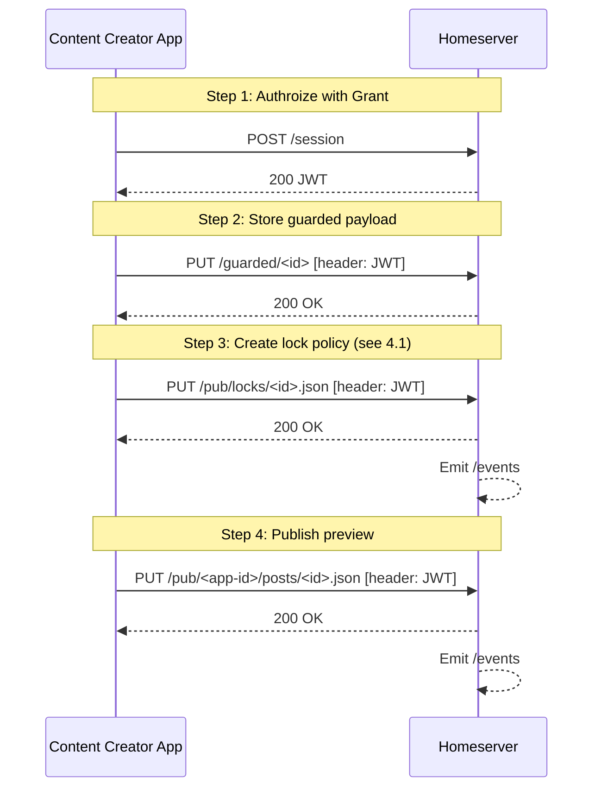
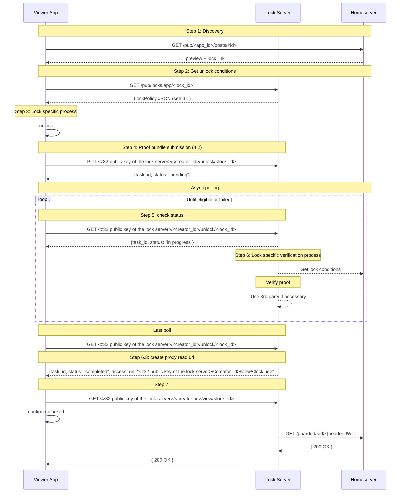

# Pubky Locks: Auth restricted proxy pass for locked content

**Version**: 0.4  
**Date**: April 10, 2026  
**Status**: Draft  
**Author**: Synonym  

---

## 1. Intro
### 1.1. What is Locks

Locks is the content gating application for the Pubky ecosystem. Content creators attach criteria like payment, password, or any future proof types to their content. Viewers  receive an access to the guarded content by satisfying those criteria.

### 1.2. What this proposal is not

This proposal does not provide any insight into how locks can be verified. Neither it provides extensive list of possible locks. Each unique lock type will be added separately and its verification will be dependent on the nature of the specific lock.

### 1.3. Goals
Design of this proposal was created with the following goals
- Enable lock functionality with minumum distrubance of existing pubky stack elements
- Simple implementation with clear set of trade-offs and know path for their mitigation 
- Locks should be delivered into pubky ecosystem without disturbance of existing trust assumptions
- Locks implementation should fit into existing narative of the credible exit

## 2. Proposal
### 2.1 Terminology
**Locks server** (alt. Guard Server or Proof server) is a pubky ecosystem application from the perspecti of permissions and autentication. Meaning it has permissions to write to homeserver based on user signed grant which are enabled by JWT token, issued upon request with Proof-of-Possesion. For more details see [JWT-Auth-proposal](https://github.com/pubky/pubky-core-braindump-jan2026/blob/jwt-auth-update/proposals/jwt-session/proposal-v4-pop.md) 
From the traditional web point of view it is a server which may or may not have user interface.
**Content creator** is a user of pubky ecosystem who creates content which they want to put "behind lock". Meaning that content can be available only to content viewers.

**Content viewers** are users (not necessarily account holders) of the pubky ecosystem who are able to provide satisfactory proofs to "locking criteria"

**Content lock** a structured data which specifies criteria for accessing content behind lock

**Proof bundle** a structured data which provides all the necessary information to locks server regarding satisfaction of criteria specified in content lock

### 2.2 Lock server
Lock server as a pubky application provides optional functionality for content creator to:
- Create content at `/guarded/*` in creator's homserver
- Create content at `/pub/locks.app/*` for content creator
Alternatively content creator can do this using any other methods available.

Lock server as a pubky application provides functionality for content viewer to:
- Accept and Verify reader's proof bundles
- Proxy read content from `pubky<creator_public_key>/guarded/<content_id>`

Lock server requires the following capabilities authorized by content creator `[/guarded/*:r]`.
Optionally it may have up to `[/guarded/*:rw,/pub/locks.app/*:rw] ` in case if locks and are to be created through it.

Lock server has own pkarr record just like homeserver:
```
@    A    <IP>
@    HTTPS    <domain name>
...
```

Lock server provides secure communication with Viewer Application.

### 3. Flow and diagrams

#### 3.1 Content creation
##### Flow 3.1
1. Content creator authorizes app for writing to homeserver
2. Content creator uploads content to be guarded to their homeserver under `/guarded/<content_id>` (no `/events` entry on homeserver as it is private endpoint)
3. Content creator defines lock conditions and uploads lock conditions to homeserver `/pub/locks.app/<lock_id>` (triggers `/events` entry on homeserver)
    1. Alternatively, lock service url can be stored in  `/pub/locks.app/config.json`:
    ```json
    {
        "locks_service_url": "<z32 public key of the lock server>/<creator_id>/unlock/<lock_id>"
    }
    ```
    2. More crazy alternative is to store in user's pkarr record as:
    ```
    _pubky HTTPS <homeserver public key>
    _locks HTTPS <lock server public key>
    ```
4. Content creator creates "preview" post anywhere (like on a pubky.app post)
    ```
    Check out my locked content at `pubky<user public key>/pub/locks.app/<lock_id>`
    ```

##### Diagram 3.1 (simplified)



#### 3.2 Content retrieval

##### Flow 3.2
1. Reader discovers lock either through "preview" post or via `/events` endpoint (missing context in the later case)
2. Reader gets "unlock conditions" by reading public `/pub/locks.app/<lock_id>` from the homeserver (alternatively requires one more read of the `/pub/locks.app/config.json` or more elaborete pkarr record parsing)
3. Reader "solves the lock"
4. Reader "provides the proof bundle" to `PUT <z32 public key of the lock server>/<creator_id>/unlock/<lock_id>` (from step 2)
5. Reader polls verification status `GET <z32 public key of the lock server>/<creator_id>/unlock/<lock_id>`
6. Lock server:
    1. Reads lock conditions `<creator_id>/pub/locks.app/<lock_id>`
    2. "verifies the proof"
    3. In case of success it creates "unlock URL" `<z32 public key of the lock server>/<creator_id>/view/<lock_id>` and shares it with reader
7. Reader sends request to "unlock URL" `<z32 public key of the lock server>/view/<lock_id>`
8. Lock server proxy-get request to homeserver and proxy-pass response to reader using own JWT

##### Diagram 5.2


#### 3.3 Lock service migration (credible exit)
Flow: Lock service migration
- Revoke `locks.app` session (`/guarded/:r`)
- All `/pub/locks.app/<lock_id>` need to have the `"locks_app"` updated to a new one
  - alternatively in `/pub/locks.app/config.json`
  - alternatively in pkarr record

### 4. Payload examples
#### 4.1 Lock policy
```json
{
  "resource_guarded": "pubky<creator_z32>/guarded/<id>.json",
  "criteria": [
    {
      "id": "crit_1",
      "type": "payment",
      "params": { "amount": "50000", "asset": "BTC", "provider": "paykit" } 
    }
  ],
  "logic": { "op": "ALL", "criteria_ids": ["crit_1"] },
  "token_ttl_sec": 3600,
  "locks_service_url": "<z32 public key of the lock server>/<creator_id>/unlock/<lock_id>"
}
```
#### 4.2 Proof bundle
```json
{
  "proof_bundle": {
    "v": 1,
    "lock_id": "lock_abc123",
    "viewer": "<viewer_z32>", // not really needed ??
    "proofs": [
      {
        "criterion_id": "crit_1",
        "type": "payment",
        "ref_uri": "paykit:invoice_ref_xyz"
      }
    ],
    "client_time": 1769500100
  },
}
```
