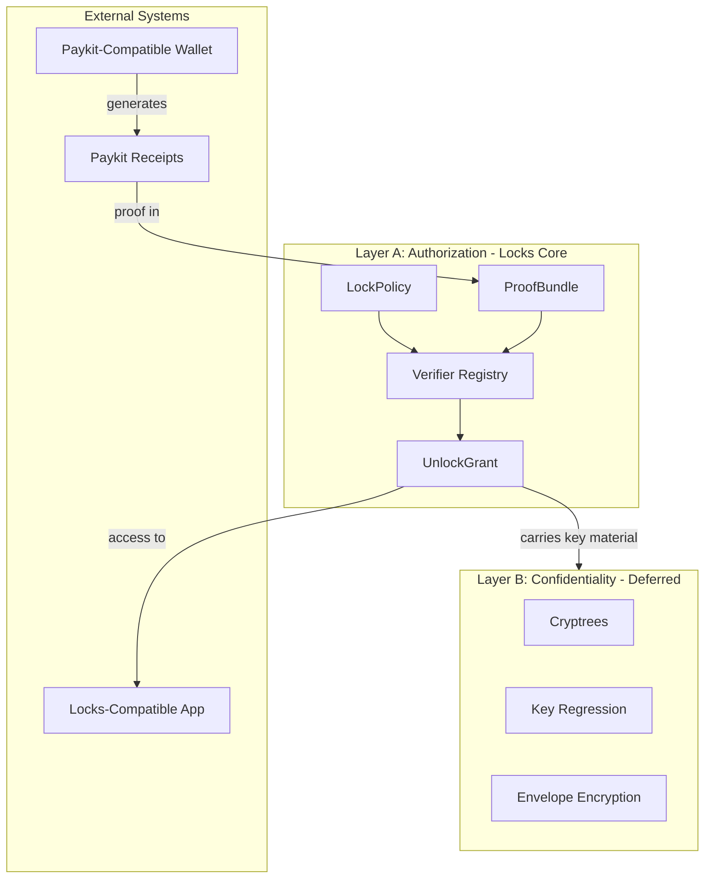

# Pubky Locks: Specification and Implementation Plan

**Version**: 0.1  
**Date**: March 26, 2026  
**Status**: Draft  
**Author**: John Carvalho / Synonym  
**Upstream**: PUBKY_CRYPTO_SPEC v2.5, PAYKIT_PROTOCOL_V0 v0.4, BIP-Paykit 0.1.0

---

## 1. Doctrine

These five rules govern every design decision. When in doubt, re-read them.

1. **Locks verifies proofs.** It does not process payments, manage subscriptions, or run identity.
2. **Paykit proves payment.** Receipts are the bridge. Locks consumes them; Paykit produces them.
3. **Wallets move money.** Bitkit is the first wallet. It will not be the only one.
4. **Homeservers issue grants.** The creator's signed policy authorizes the homeserver to act on their behalf.
5. **Encryption is optional.** Authorization gating ships first. Confidential content delivery ships later.

---

## 2. What Locks is

Locks is the authorization and commerce layer for the Pubky ecosystem. It lets creators gate resources -- posts, files, collections, feeds, features, accounts -- using signed policies. Viewers satisfy one or more conditions (payment, password, tag credential, time window, puzzle, contract signature). The creator's homeserver verifies those proofs and issues a time-bounded access grant. Payments happen out-of-band in Paykit-compatible wallets. Locks never touches funds.

### Product goals

- Monetize content and features without custody or intermediaries
- Keep locked resources discoverable (the lock itself is a signal of value)
- Work across apps and wallets, not only Synonym products
- Support broader gating than simple paywalls (memberships, credentials, crowdfunding thresholds, proofs of work)
- Fit the Atomic Economy stack without introducing centralized chokepoints

### Non-goals

Locks does not:

- Process or hold payments (Paykit + wallets do that)
- Manage recurring billing (Paykit subscriptions do that)
- Replace or duplicate the semantic social graph
- Define new PKARR storage semantics
- Provide universal DRM or piracy prevention
- Enforce access for content that has already been delivered to a client

---

## 3. Trust model

MVP uses an **honest gatekeeper** model:

- The homeserver is trusted to run verifiers honestly and issue grants only when proofs satisfy the policy
- The creator-signed policy constrains what the homeserver may do -- it cannot invent grants for policies it did not receive
- Grants bind to the policy hash, preventing substitution
- Idempotency prevents double-charging
- Optional audit logs improve accountability

Do not market this as trustless. It is not. The creator trusts their homeserver to enforce their policy, the same way they already trust it to store and serve their data. This is a natural extension of the existing Pubky trust model, not a new trust assumption.

### Delegation model

The Pubky key hierarchy (PUBKY_CRYPTO_SPEC v2.5) separates key roles:

| Key | Custody | Locks role |
|-----|---------|------------|
| **RootKey** | Ring (semi-cold) | Identity anchor. Signs AppCerts only. |
| **Content AppKey** | App (via AppCert) | Signs LockPolicies and other content objects. |
| **Locks AppKey** | Homeserver (via AppCert) | Signs UnlockGrants on the creator's behalf. |

The delegation chain for **policy creation** is:

1. Creator's RootKey issues an AppCert for a content AppKey (held by the app, e.g. Pubky App)
2. The content AppKey signs LockPolicies during the normal publish flow
3. Verifiers trace the chain: AppCert signed by RootKey → content AppKey signed the policy

The delegation chain for **grant issuance** is:

1. Creator's RootKey issues an AppCert authorizing a `locks` AppKey held by the homeserver
2. The `locks` AppKey is published in the creator's KeyBinding under `app_keys[]`
3. The homeserver uses this AppKey to sign UnlockGrants
4. Verifiers trace the chain: AppCert signed by RootKey → `locks` AppKey signed the grant

This keeps the RootKey semi-cold in Ring. The creator's app handles routine policy signing via content AppKey. The homeserver handles grant signing via its own delegated AppKey. Neither requires the RootKey to be hot. AppCerts can be scoped and time-limited. Revocation is achieved by publishing a new KeyBinding without the revoked AppKey.

### Grant validation rule

A valid UnlockGrant must satisfy **both** conditions:

1. The signing key is listed in the policy's `grant_issuers` array
2. The signing key is currently authorized by the creator's KeyBinding/AppCert delegation chain

Both must hold simultaneously. If either condition fails -- the key is removed from `grant_issuers` in a policy update, or the creator revokes the AppCert in their KeyBinding -- the grant is invalid. This prevents ambiguity when delegation and policy change independently.

---

## 4. Architecture

### 4.1 Layers

The design ships in two layers:

**Layer A: Authorization core (MVP)**

- LockPolicy, ProofBundle, UnlockGrant
- Verifier registry with payment and password verifiers
- Idempotency store
- Grant middleware on the homeserver
- Wallet handoff protocol
- Discovery signaling
- Audit logging
- PoP grant presentation

**Layer B: Confidential content delivery (deferred)**

- Encrypted artifact payloads
- Content-key outputs in UnlockGrant
- Noise-based or envelope-based key transport
- Key regression for rotating subscription content

Layer B does not block MVP. It is future work that should be designed in parallel but shipped only after Layer A is proven.

### 4.2 Canonical flow

```
1. Creator publishes a resource (post, file, collection)
2. Creator publishes a LockPolicy attached to that resource
3. Creator publishes a lock presence signal on the resource metadata
4. Viewer discovers the resource (via Nexus, feed, direct link)
5. Viewer sees the lock indicator and fetches the LockPolicy
6. Viewer obtains the required proofs (pays via wallet, enters password, etc.)
7. Viewer submits a ProofBundle to the creator's homeserver
8. Homeserver evaluates proofs against the policy
9. Homeserver issues an UnlockGrant signed with its delegated AppKey
10. Viewer presents the grant to access the guarded resource
```

### 4.3 Guarded data

Locks introduces a guarded access state on resources. **Guarded is an access-control state on public-addressable resources, not a third filesystem namespace.** There is no `/guarded/` path prefix.

| State | Who can read | Path |
|-------|-------------|------|
| **Public** | Anyone | `/pub/...` |
| **Guarded** | Anyone with a valid UnlockGrant | `/pub/...` (same namespace, grant-required flag set) |
| **Private** | Only the owner | `/priv/...` |

Guarded data lives under `/pub/` (so it is addressable and discoverable) but the homeserver requires a valid grant header before serving the full payload. The preview/teaser portion of a guarded resource is always public. The guarded portion is withheld until a grant is presented.

Implementation note: the homeserver enforces this at the HTTP layer. A request for a guarded resource without a valid `Authorization: PubkyGrant <base64url-grant>` header receives:

- `402 Payment Required` -- when at least one criterion in the policy is type `payment` or `crowdwall`
- `403 Forbidden` -- when the lock is password-only, tag-only, or otherwise non-payment

Both responses include the policy URI in a `Link: <policy-uri>; rel="lock-policy"` header so the client can fetch the policy and determine how to unlock.

---

## 5. Cryptographic conventions

### 5.1 Canonical encoding (v1)

All signed JSON objects (LockPolicy, ProofBundle, UnlockGrant, tag credentials, revocations) MUST be canonicalized using the JSON Canonicalization Scheme (JCS), [RFC 8785](https://www.rfc-editor.org/rfc/rfc8785).

Additional v1 constraints:

- Floats MUST NOT appear (integers or strings only)
- Byte arrays MUST be encoded as base64url (no padding)
- Signatures MUST be raw 64-byte Ed25519, base64url-encoded
- Unknown fields in signed objects MUST be rejected unless the field name starts with `x_` (extension namespace)

Future versions MAY introduce a binary wire format using deterministically encoded CBOR ([RFC 8949](https://www.rfc-editor.org/rfc/rfc8949.html) Section 4.2) with COSE ([RFC 9052](https://www.rfc-editor.org/rfc/rfc9052)), but JSON+JCS is the canonical format for v1.

### 5.2 Domain separation constants

All cryptographic operations use domain-separated prefixes per PUBKY_CRYPTO_SPEC Appendix A:

| Operation | Domain String |
|-----------|---------------|
| LockPolicy signature | `"pubky-locks/policy/v1"` |
| ProofBundle signature | `"pubky-locks/proof-bundle/v1"` |
| UnlockGrant signature | `"pubky-locks/grant/v1"` |
| Lock commitment | `"pubky-locks-v1:payment"` (as `domain` field in JCS commitment object) |
| Idempotency key | `"pubky-locks-v1:idempotency"` (as `domain` field in JCS idempotency object) |
| Policy hash | `"pubky-locks/policy-hash/v1"` |
| PoP request binding | `"pubky-locks/pop/v1"` |
| Content-key AAD (Phase 4) | `"pubky-locks/content-key/v1:"` |

### 5.3 Identifier formats

| Identifier | Format | Length | Example |
|------------|--------|--------|---------|
| `lock_id` | 16 random bytes, base64url | 22 chars | `8um71usABc...` |
| `grant_id` | 16 random bytes, base64url | 22 chars | `tj1igrXyz...` |
| `policy_hash` | SHA256, prefixed | variable | `sha256:<base64url>` |
| `cert_id` | first 16 bytes of SHA256(cert_body), hex | 32 chars | `abc123...def456` |
| pubkey display | z-base-32 Ed25519 | 52 chars | `pk:<z32>` |

---

## 6. Architecture overview



---

## 7. Core objects

### 7.1 LockPolicy

The creator-signed policy on a resource. Signed by the creator's content AppKey (not the RootKey -- see section 3, delegation model).

| Field | Type | Required | Description |
|-------|------|----------|-------------|
| `v` | integer | yes | Schema version. `1` for this spec. |
| `lock_id` | string | yes | Unique identifier for this lock instance. 16 random bytes, base64url. |
| `resource` | string | yes | URI of the gated resource. `pubky://<z32-pubkey>/pub/...` |
| `creator` | string | yes | Creator's RootKey Ed25519 pubkey. `pk:<z32>` |
| `criteria` | array | yes | List of proof criteria (see 5.1.1) |
| `logic` | object | yes | Boolean logic tree combining criteria (see 5.1.2) |
| `grant_issuers` | array | yes | Ed25519 pubkeys authorized to sign grants. Typically the homeserver's delegated `locks` AppKey. |
| `grant_ttl_sec` | integer | yes | Default grant lifetime in seconds |
| `grant_mode` | string | yes | `"pop"` or `"bearer"`. Default `"pop"`. |
| `preview` | object | no | Preview metadata visible without unlocking |
| `created_at` | integer | yes | Unix timestamp (seconds) |
| `expires_at` | integer | no | Policy expiration. Null means indefinite. |
| `signer` | string | yes | Content AppKey pubkey that produced `sig`. `pk:<z32>` |
| `signer_cert_id` | string | yes | The `cert_id` linking this AppKey to the creator's RootKey via AppCert. `<hex>` |
| `sig` | string | yes | Ed25519 signature by the content AppKey over the JCS-canonical form (excluding only the `sig` field itself) |

Verifiers trace the delegation chain: fetch the creator's KeyBinding for the relevant `app_id`, confirm the `signer` key appears in `app_keys[]`, fetch the AppCert by `signer_cert_id`, verify the AppCert is signed by the `creator` RootKey, then verify `sig` against the `signer` key.

#### 7.1.1 Criteria

Each criterion defines one condition that can be satisfied by a proof.

**Payment criterion:**

```json
{
  "id": "pay",
  "type": "payment",
  "merchant": "pk:<z32>",
  "amount": "50000",
  "asset": "BTC",
  "receipt_window_sec": 86400
}
```

`amount` is a string representation of the value in the base unit of `asset`. `asset` identifies the denomination (v1 implementations validate `BTC` only, per BIP 177 where 1 bitcoin is the base indivisible unit; the schema supports future extension). `receipt_window_sec` defines how old a receipt can be when submitted. `merchant` is the payee's pubkey -- the homeserver verifies the receipt was paid to this key.

**Password criterion:**

```json
{
  "id": "pwd",
  "type": "password",
  "challenge_required": true
}
```

Password locks use a challenge-response model. The password hash is NOT published in the policy. Instead:

1. Viewer requests a challenge from the homeserver (`GET /.well-known/locks/challenge?lock_id=...`)
2. Homeserver returns a random nonce with a short TTL
3. Viewer computes `proof = HMAC-SHA256(Argon2id(password, stored_salt), nonce)`
4. Homeserver verifies by recomputing with its stored hash

The creator sets the password via authenticated homeserver API. The homeserver stores `Argon2id(password, random_salt)` privately. This prevents offline brute-force attacks against a public hash.

**Tag criterion (v2):**

```json
{
  "id": "member",
  "type": "tag",
  "issuer": "pk:<z32>",
  "tag_id": "membership:gold",
  "check_revocation": true
}
```

**Crowdwall criterion (v2):**

```json
{
  "id": "crowd",
  "type": "crowdwall",
  "merchant": "pk:<z32>",
  "threshold": "500000",
  "per_contribution_min": "1000",
  "asset": "BTC"
}
```

The resource unlocks for everyone once cumulative contributions reach the threshold. Progress is public (total collected vs threshold). Individual contribution amounts are not disclosed.

#### 7.1.2 Logic tree

The logic tree combines criteria using boolean operators. v1 supports `ANY` (OR) and `ALL` (AND). Max depth: 2 levels. Max criteria: 8.

```json
{
  "op": "ANY",
  "args": [
    { "ref": "pay" },
    { "ref": "pwd" }
  ]
}
```

Nested example (v2):

```json
{
  "op": "ALL",
  "args": [
    { "ref": "member" },
    { "op": "ANY", "args": [{ "ref": "pay" }, { "ref": "pwd" }] }
  ]
}
```

`ref` values must match a `criterion.id`. A logic tree referencing an undefined criterion is invalid.

### 7.2 ProofBundle

The viewer's submission of proofs to the homeserver.

| Field | Type | Required | Description |
|-------|------|----------|-------------|
| `v` | integer | yes | `1` |
| `lock_id` | string | yes | Must match the policy |
| `resource` | string | yes | Must match the policy |
| `viewer` | string | yes | Viewer's pubkey. `pk:<z32>` |
| `proofs` | array | yes | Proof objects (see 7.2.1) |
| `client_time` | integer | yes | Viewer's claimed Unix timestamp (seconds). Homeserver MAY reject if clock skew > 300s. |
| `sig` | string | yes | Viewer's Ed25519 signature over the JCS-canonical form (excluding `sig` field) |

#### 7.2.1 Payment proof

```json
{
  "criterion_id": "pay",
  "type": "payment",
  "receipt": {
    "receipt_id": "receipt_001",
    "payer": "pubky://<z32-payer>",
    "payee": "pubky://<z32-merchant>",
    "method_id": "lightning",
    "amount": "50000",
    "asset": "BTC",
    "created_at": 1769500000,
    "metadata": {
      "locks": {
        "lock_id": "<lock_id>",
        "resource": "pubky://<z32>/pub/...",
        "lock_commitment": "<base64url>"
      }
    },
    "proof": {
      "type": "lightning_preimage",
      "preimage": "<hex>",
      "payment_hash": "<hex>"
    }
  }
}
```

The receipt follows the Paykit receipt format (BIP-Paykit Section "Receipt Format" and "Payment Proofs"). The receipt's `metadata.locks` object contains the Locks-specific extension fields. See section 9 for lock commitment construction.

#### 7.2.2 Password proof

```json
{
  "criterion_id": "pwd",
  "type": "password",
  "challenge_nonce": "<base64url>",
  "response": "<base64url>"
}
```

### 7.3 UnlockGrant

The homeserver's response after successful verification.

| Field | Type | Required | Description |
|-------|------|----------|-------------|
| `v` | integer | yes | `1` |
| `grant_id` | string | yes | Unique grant identifier. 16 random bytes, base64url. |
| `lock_id` | string | yes | From the policy |
| `resource` | string | yes | The unlocked resource URI |
| `subject` | string | yes | Viewer's pubkey. `pk:<z32>` |
| `mode` | string | yes | `"pop"` or `"bearer"` |
| `rights` | array | yes | e.g. `["read"]` |
| `issued_at` | integer | yes | Unix timestamp (seconds) |
| `expires_at` | integer | yes | Unix timestamp (seconds). `issued_at + grant_ttl_sec` from policy. |
| `policy_hash` | string | yes | `sha256:<base64url>` of the JCS-canonical LockPolicy (excluding `sig`). Binds the grant to the exact policy version. |
| `idempotency_key` | string | no | `sha256:<base64url>` per section 9.2. Present for payment grants. Absent for password grants. |
| `issuer` | string | yes | Signing key pubkey. This is the homeserver's delegated AppKey, not the creator's RootKey. `pk:<z32>` |
| `issuer_cert_id` | string | yes | The `cert_id` linking this AppKey to the creator's RootKey via AppCert. `<hex>` |
| `sig` | string | yes | Ed25519 signature by the AppKey over the JCS-canonical form (excluding `sig` field) |

### 7.4 Grant presentation (Proof of Possession)

When `mode` is `"pop"`, the viewer must prove they control the `subject` key when presenting the grant. The presentation is an HTTP header:

```
Authorization: PubkyGrant <base64url-grant>
X-Pubky-Grant-Pop: <base64url-pop>
```

The PoP value is:

```json
{
  "grant_id": "<grant_id>",
  "resource": "<resource-uri>",
  "timestamp": <current-unix-seconds>,
  "sig": "<base64url>"
}
```

Where `sig` is the viewer's Ed25519 signature over the JCS-canonical form of the object (excluding `sig`). The homeserver verifies:

1. `sig` is valid for the `subject` key in the grant
2. `timestamp` is within 60 seconds of server time
3. `grant_id` and `resource` match the grant

When `mode` is `"bearer"`, the `Authorization` header alone is sufficient. Bearer mode is acceptable only for low-value content where grant sharing is tolerable.

### 7.5 Verify response

**Success:**

```json
{
  "status": "ok",
  "grant": "<base64url-encoded UnlockGrant>",
  "grant_id": "...",
  "expires_at": 1769503605
}
```

**Failure:**

```json
{
  "status": "error",
  "code": "VERIFICATION_FAILED",
  "failed_criteria": [
    { "criterion_id": "pay", "reason": "receipt_expired" }
  ],
  "passed_criteria": ["pwd"],
  "logic_result": false
}
```

**Error codes (v1):**

| Code | Meaning |
|------|---------|
| `POLICY_NOT_FOUND` | No lock exists for this resource |
| `POLICY_EXPIRED` | The lock policy has expired |
| `INVALID_SIGNATURE` | ProofBundle signature invalid |
| `VERIFICATION_FAILED` | One or more proofs failed verification |
| `RECEIPT_EXPIRED` | Payment receipt outside `receipt_window_sec` |
| `RECEIPT_REPLAY` | Receipt already used -- not emitted as an error. Server returns `status: "ok"` with the existing or refreshed grant. Listed here for internal classification only. |
| `RECEIPT_AMOUNT_MISMATCH` | Receipt amount does not match criterion |
| `RECEIPT_MERCHANT_MISMATCH` | Receipt payee does not match criterion merchant |
| `COMMITMENT_MISMATCH` | Receipt `lock_commitment` does not match expected value |
| `CHALLENGE_EXPIRED` | Password challenge nonce expired |
| `CHALLENGE_INVALID` | Password response incorrect |
| `CLOCK_SKEW` | Client timestamp too far from server time |
| `RATE_LIMITED` | Too many verification attempts |
| `INTERNAL_ERROR` | Server-side error |

On `RECEIPT_REPLAY`, the homeserver returns the original grant (or a refreshed grant with the same idempotency key) with status `"ok"`. This is not an error from the viewer's perspective.

---

## 8. Discovery signaling

Locked content must be discoverable. The lock itself is a signal of value.

### 8.1 Resource-level lock metadata

When a creator attaches a lock to a resource, the resource's public metadata includes a lock signal:

```json
{
  "lock": {
    "lock_id": "<lock_id>",
    "types": ["payment"],
    "amount": "50000",
    "asset": "BTC",
    "policy_uri": "pubky://<z32>/pub/<app-id>/locks/policies/<lock_id>.json"
  }
}
```

This object is small enough to inline in a post's metadata without bloating feeds. Indexers (Nexus) can index the `lock` field to:

- Show lock indicators in feeds
- Filter/sort by locked vs unlocked content
- Display price information
- Enable "locked content" discovery feeds

### 8.2 Preview and payload separation

Following the pattern from Fanfares: locked resources should separate preview content from guarded content as distinct objects.

For a locked post:

- **Preview** (always public): title, excerpt, author, tags, lock metadata, thumbnail
- **Payload** (guarded): full body, media, attachments

The preview is a complete, renderable object. It is not a stub or placeholder. A feed of locked posts should look rich and intentional, not like a wall of padlocks.

Implementation: the app stores preview data at the resource's public path and guarded data at a suffixed path (e.g., `/pub/<app-id>/posts/<id>/preview.json` and `/pub/<app-id>/posts/<id>/payload.json`). The homeserver applies grant-required gating only to the payload path.

---

## 9. Receipt binding and replay control

### 9.1 Lock commitment

When a wallet pays a Locks-initiated payment, it embeds a `lock_commitment` in the Paykit receipt metadata. This binds the receipt to a specific lock and prevents cross-lock replay.

**Construction:**

The commitment is the SHA256 hash of a JCS-canonical (RFC 8785) JSON object:

```json
{
  "amount": "50000",
  "asset": "BTC",
  "domain": "pubky-locks-v1:payment",
  "lock_id": "8um71us...",
  "merchant": "pk:<z32>",
  "resource": "pubky://<z32>/pub/..."
}
```

```
lock_commitment = SHA256(JCS(commitment_object))
```

Using JCS ensures deterministic serialization across languages and platforms. The `domain` field provides domain separation. All fields are strings. The canonical JSON key ordering is alphabetical per JCS, making the construction unambiguous without manual field-ordering rules.

The wallet computes this from the payment request (section 11) and includes it as `receipt.metadata.lock_commitment` (base64url-encoded). The homeserver recomputes it from the policy and verifies it matches.

If the receipt lacks a `lock_commitment`, the homeserver MAY accept it in v1 for backward compatibility with wallets that have not yet implemented Locks-aware receipts. This leniency MUST be removed in v2.

### 9.2 Idempotency

Idempotency is primarily a concern for **payment proofs**, where double-charging is unacceptable.

**Payment idempotency key:**

```
idempotency_key = SHA256(JCS({
  "domain": "pubky-locks-v1:idempotency",
  "lock_id": "<lock_id>",
  "receipt_hash": "<SHA256 of JCS-canonical receipt>",
  "viewer": "<viewer_pubkey>"
}))
```

Behavior on duplicate submission:

- If a successful grant exists for this idempotency key and has not expired: return the existing grant with `status: "ok"`
- If the existing grant has expired: issue a new grant with the same idempotency key
- Never charge twice for the same receipt against the same lock

**Password locks do not need payment-style idempotency.** There is no financial cost to re-verifying a password. The homeserver simply checks whether the viewer already has an active grant for this lock before requiring a new challenge-response. If an active grant exists, return it. If not, issue a new challenge. No idempotency store entry is needed for password proofs.

### 9.3 Rate limiting

The homeserver MUST rate-limit the verify endpoint per (lock_id, viewer) pair:

| Lock Type | Limit | Window | Lockout |
|-----------|-------|--------|---------|
| Payment | No limit | - | - |
| Tag/membership | No limit | - | - |
| Password | 5 attempts | 15 min | 1 hour |
| Puzzle (v3) | 10 attempts | 1 min | 5 min |

Global limits also apply:

- Per resource: max 100 attempts per minute across all viewers
- On rate limit: return `RATE_LIMITED` error with `Retry-After` header

### 9.4 No atomic payment-delivery guarantee

The system is best-effort, not atomic. The viewer pays first, then receives a grant. If the homeserver crashes between payment receipt and grant issuance, the viewer must retry. Idempotency ensures the same receipt returns the same grant -- the viewer is never charged twice. But the window between payment and grant issuance is a known gap, not a bug. Apps should handle this gracefully: save the receipt locally before submitting the proof, so the receipt survives app or server failure.

---

## 10. Storage model

### 10.1 Protocol vs implementation

The Locks protocol defines object shapes, verification rules, and API contracts. It does NOT prescribe storage paths. Storage paths are implementation details that vary by app.

For Pubky App v1, the suggested paths are:

| Object | Path | Access |
|--------|------|--------|
| LockPolicy | `/pub/<app-id>/locks/policies/<lock_id>.json` | Public |
| Preview | `/pub/<app-id>/posts/<id>/preview.json` | Public |
| Guarded payload | `/pub/<app-id>/posts/<id>/payload.json` | Guarded (grant required) |
| Revocation list | `/pub/<app-id>/locks/revocations.json` | Public |
| Audit log | `/priv/<app-id>/locks/audit/<lock_id>.jsonl` | Private (creator only) |
| Password store | Homeserver internal DB | Never exposed |

These are implementation paths for Pubky App, not protocol identity. Other apps building on Locks use their own path conventions. The protocol boundary is the API (section 12), not the filesystem.

### 10.2 Indexer behavior

Indexers (Nexus) MAY index:

- Lock existence and type (from resource metadata `lock` field)
- Price/amount information
- Lock expiration status

Indexers MUST NOT index:

- Submitted proofs
- Receipts
- Grants
- Password attempts
- Audit logs

---

## 11. Wallet integration

### 11.1 Payment request

When a viewer needs to pay to unlock, the app constructs a payment request and hands it to the wallet via deep link:

```json
{
  "type": "pubky-locks-payment",
  "v": 1,
  "lock_id": "<lock_id>",
  "resource": "pubky://<z32>/pub/...",
  "amount": "50000",
  "asset": "BTC",
  "merchant": "pk:<z32>",
  "lock_commitment": "<base64url>",
  "callback": "<app-scheme>://locks/receipt?lock_id=<lock_id>"
}
```

Deep link format:

```
bitkit://pay?locks=<base64url-encoded-request>
```

For requests that would exceed URL length limits (unlikely for v1 but possible with extension fields), the app writes the request to a temporary homeserver path and passes a reference:

```
bitkit://pay?locks_ref=pubky://<z32>/pub/<app-id>/locks/requests/<request_id>.json
```

### 11.2 Wallet responsibilities

The wallet (Bitkit or any Paykit-compatible wallet):

1. Parses the payment request
2. Discovers the merchant's payment methods via Paykit directory (`/pub/paykit.app/v0/`)
3. Executes the payment (Lightning, on-chain, or other supported method)
4. Generates a `PaykitReceipt` per the BIP-Paykit receipt format
5. Includes `lock_commitment` in `receipt.metadata` when the request contains a `lock_id`
6. Returns the receipt to the requesting app via the callback URI

### 11.3 Receipt return

The wallet calls back to the app with:

```
<callback>?receipt=<base64url-encoded-receipt>
```

The app then constructs a ProofBundle and submits it to the homeserver's verify endpoint.

### 11.4 Wallet-agnostic design

The deep link scheme (`bitkit://pay`) is Bitkit-specific. Other wallets register their own schemes. The payment request format is wallet-agnostic. Apps SHOULD support multiple wallet schemes and let the user choose. The app discovers installed wallets by attempting scheme resolution or by checking a wallet registry published by the user at `/pub/paykit.app/v0/wallet-preference`.

---

## 12. API

All Locks API endpoints live under `/.well-known/locks/` on the creator's homeserver. This is a service endpoint, not a data path.

### 12.1 Get policy

```
GET /.well-known/locks/policy?resource=<pubky-uri>
```

**Response:**

- `200` with LockPolicy JSON
- `404` if no lock exists for this resource
- `410` if the lock or resource has been removed

### 12.2 Get challenge (for password locks)

```
GET /.well-known/locks/challenge?lock_id=<lock_id>
```

**Response:**

```json
{
  "nonce": "<base64url, 32 random bytes>",
  "expires_at": 1769500300
}
```

Nonce TTL: 300 seconds. One-time use.

### 12.3 Verify

```
POST /.well-known/locks/verify
Content-Type: application/json

{
  "proof_bundle": { ... }
}
```

**Response:** See section 7.5.

### 12.4 Refresh grant

```
POST /.well-known/locks/refresh
Content-Type: application/json

{
  "grant_id": "<grant_id>",
  "sig": "<base64url>"
}
```

Where `sig` is the viewer's Ed25519 signature over `JCS({"grant_id": "...", "timestamp": <now>})`. The homeserver verifies the signature matches the grant's `subject` key.

**Response:**

- `200` with a new UnlockGrant (same idempotency key, new `issued_at`/`expires_at`)
- `403` if the original grant's idempotency key has been invalidated (e.g., policy changed)
- `404` if grant not found

Refresh is allowed as long as the underlying policy has not changed (same `policy_hash`). If the creator updates the policy, existing grants cannot be refreshed -- the viewer must re-verify.

### 12.5 Access guarded resource

```
GET /pub/<app-id>/posts/<id>/payload.json
Authorization: PubkyGrant <base64url-grant>
X-Pubky-Grant-Pop: <base64url-pop>
```

**Response:**

- `200` with the guarded resource content
- `402` if no valid grant and at least one criterion is `payment` or `crowdwall` (includes `Link: <policy-uri>; rel="lock-policy"`)
- `403` if no valid grant and the lock is non-payment (password, tag, etc.), or if a grant is presented but PoP is invalid or grant expired (includes `Link: <policy-uri>; rel="lock-policy"`)

### 12.6 Creator endpoints

These require authenticated homeserver sessions (existing Pubky auth).

**Create/update lock:**

```
PUT /.well-known/locks/manage
Content-Type: application/json

{
  "policy": { ... }
}
```

**Remove lock:**

```
DELETE /.well-known/locks/manage?lock_id=<lock_id>
```

Removing a lock makes the guarded resource publicly accessible again. Existing grants become meaningless (the resource no longer requires one).

**Set password (for password locks):**

```
POST /.well-known/locks/manage/password
Content-Type: application/json

{
  "lock_id": "<lock_id>",
  "password": "<plaintext>"
}
```

The homeserver hashes the password with Argon2id and a random salt. The plaintext is never stored or logged.

**Tag credential endpoints (v2):**

```
POST /.well-known/locks/tags/issue
POST /.well-known/locks/tags/revoke
```

---

## 13. UX model

### 13.1 Viewer experience

Locked content is visible in feeds and search. The lock indicator shows the lock type and price. Tapping a locked resource opens an unlock modal:

- **Pay with wallet**: deep-links to wallet, returns receipt, submits proof, receives grant, content loads
- **Enter password**: requests challenge from homeserver, submits response, receives grant, content loads
- **Already paid?**: paste or import a receipt from another device or session

The entire unlock flow should complete in under 10 seconds for Lightning payments. If it takes longer, the UX is broken.

### 13.2 Creator experience

A creator locks content through the app's publish flow:

1. Create or select a resource (post, collection, file)
2. Choose lock type (payment, password, or both via `ANY` logic)
3. Set parameters (amount, password)
4. The app constructs and signs a LockPolicy
5. The app publishes the policy and updates the resource metadata with the lock signal
6. The app sets the guarded data flag on the payload path

### Lock editing semantics

A `lock_id` is immutable per lock instance. Edits fall into two categories:

- **Material edits** (changes to `criteria`, `logic`, `grant_issuers`, `grant_mode`, or `grant_ttl_sec`) create a **new lock instance** with a new `lock_id`. The old lock is removed. Existing grants for the old policy cannot be refreshed and expire naturally. Old receipts cannot satisfy the new lock -- they are bound to the old `lock_id` via `lock_commitment`, and the new `lock_id` produces a different commitment. The viewer must pay again for the new lock. Creators should avoid material edits to paid locks. If grandfathering is needed (honoring old receipts after a policy change), that is application logic, not protocol logic.
- **Non-material edits** (changes to `preview`, `expires_at`, or extension fields) update the policy **in place** with the same `lock_id`. The `policy_hash` changes, so grant refresh will fail until viewers re-verify, but no new `lock_id` is needed and existing receipts remain valid.

### 13.3 Grant lifecycle

- Apps cache active grants locally (encrypted local storage)
- Apps attempt grant refresh at 80% of TTL
- On refresh failure, the app prompts the viewer to re-verify (which is free for idempotent receipts)
- On app reinstall, the viewer can import receipts to re-obtain grants without repaying

### 13.4 Default TTLs

| Lock type | Default grant TTL | Rationale |
|-----------|------------------|-----------|
| Payment | 30 days (2,592,000 sec) | Paid content should be accessible for a reasonable period |
| Password | 24 hours (86,400 sec) | Passwords can be changed; shorter TTL limits exposure |
| Tag/membership | 7 days (604,800 sec) | Membership status can change; moderate refresh cycle |
| Crowdwall | Indefinite (resource becomes public) | Once threshold is met, everyone gets access permanently |

Creators can override these defaults in the policy via `grant_ttl_sec`.

---

## 14. Proof types and phased rollout

### Phase 1: MVP (Q2 2026)

Ship:

- Payment locks (Lightning and on-chain receipts)
- Password locks (challenge-response)
- Discoverable locked posts with preview/payload split
- Wallet handoff (Bitkit first)
- Receipt paste/import for cross-device
- PoP grants
- Basic audit logs
- Grant refresh

This is the "Atomic Engine" quarter per the 2026 roadmap. The goal is the first end-to-end commerce loop on Pubky.

### Phase 2: Memberships and social commerce (Q3 2026)

Ship:

- Tag credentials (issuer-signed membership tokens)
- Revocation lists
- Subscription-derived credentials (Paykit subscription receipt as proof)
- Crowdwalls (cumulative payment threshold)
- Tip locks (pay-what-you-want with minimum)

This is the "Enter The Arena" quarter. Tags and memberships connect Locks to the semantic social graph.

### Phase 3: Richer conditions (Q4 2026)

Ship:

- Time locks (content available only during a window)
- Puzzle locks (proof-of-work or knowledge challenge)
- Contract locks (signed agreement as proof)

Defer geo locks unless a compelling use case with real demand appears.

### Phase 4: Encrypted artifact delivery (2027+)

Ship:

- Encrypted file/media payloads
- Content-key outputs in UnlockGrant
- Noise-based or envelope-based secure key delivery
- Per-buyer access persistence

This is where the useful ideas from PayPub (provable sample, staged reveal) and Fanfares (per-buyer unlock persistence) land as concrete features. The encrypted artifact mode uses a simpler per-resource encrypted blob approach first, with Cryptree considered only if the simpler approach proves insufficient.

### Phase 5: Advanced commerce (2027+)

Explore:

- Affiliate/referral semantics
- Marketplace attenuation tokens
- Atomicity receipt as proof type
- UCAN or Biscuit profile if UnlockGrant semantics prove too rigid

---

## 15. Paykit receipt verification

This section defines exactly how the homeserver's payment verifier validates a Paykit receipt. This is the critical integration point between Locks and Paykit.

### 15.1 Required receipt fields

The payment verifier requires these fields from the Paykit receipt (per BIP-Paykit):

| Field | Verification |
|-------|-------------|
| `payee` | Must match `criterion.merchant` (after z32 normalization) |
| `amount` | Must be >= `criterion.amount` (compared as integers in the same `asset`) |
| `asset` | Must match `criterion.asset` (v1: only `BTC` is validated, per BIP 177) |
| `created_at` | Must be within `criterion.receipt_window_sec` of current time |
| `proof.type` | Must be `"lightning_preimage"` or `"bitcoin_txid"` |
| `metadata.lock_commitment` | Must match recomputed commitment (section 9.1). Optional in v1. |

### 15.2 Lightning receipt verification

For `proof.type == "lightning_preimage"`:

1. Verify `SHA256(preimage) == payment_hash`
2. This is a pure cryptographic check -- no network call required
3. The preimage proves the payment was made because only the payee's Lightning node can release it

### 15.3 On-chain receipt verification

For `proof.type == "bitcoin_txid"`:

1. The homeserver MAY verify the transaction on-chain via an Esplora/Electrum API
2. Check: transaction exists, output pays the correct address, amount matches, has sufficient confirmations
3. Minimum confirmations: 1 for amounts below 100,000 BTC (base units per BIP 177, roughly 0.001 legacy BTC), 3 for larger amounts
4. Network verification is optional in v1. When skipped, the homeserver relies on the viewer-signed ProofBundle plus the claimed txid under the honest-gatekeeper model (see section 15.4 for the full receipt authenticity position).

### 15.4 Receipt authenticity (v1 decision)

The BIP-Paykit draft does not currently define signed receipts. This means a receipt alone does not cryptographically prove who paid or that the receipt was not fabricated.

**v1 rule:** Receipt authenticity is established by the combination of:

1. **Method-specific proof** -- the Lightning preimage or on-chain txid proves the payment actually happened
2. **Lock commitment** -- binds the receipt to the specific lock, preventing cross-lock replay
3. **Viewer-signed ProofBundle** -- the viewer signs the entire bundle including the receipt, binding their identity to the claim of payment

Together these provide sufficient assurance for the honest-gatekeeper model: the payment is real (preimage proves it), it was for this lock (commitment proves it), and this viewer claims it (ProofBundle signature proves it). A viewer who fabricates a receipt cannot produce a valid preimage.

**v2 direction:** Paykit should introduce signed receipts (signed by the payer's wallet key) to strengthen the chain. This would allow the homeserver to independently verify that the claimed payer actually authorized the payment, without relying solely on the ProofBundle signature. This is a Paykit-level change, not a Locks-level change.

### 15.5 No Paykit library dependency required

The homeserver does not need `paykit-lib` to verify receipts. Receipt verification is:

- JSON parsing
- Field matching
- SHA256 (for preimage check and commitment check)
- JCS serialization (for commitment recomputation)
- Ed25519 signature verification (for ProofBundle authenticity)
- Optional HTTP call (for on-chain confirmation)

This keeps the homeserver's dependency footprint minimal.

---

## 16. Homeserver migration and credible exit

Locks must not break credible exit.

### 16.1 Policy portability

LockPolicies are signed by the creator's content AppKey (traceable to their RootKey via AppCert), not the homeserver. When a creator migrates from Homeserver A to Homeserver B:

1. Policies are republished on Homeserver B (the creator re-uploads them)
2. The creator issues a new AppCert authorizing Homeserver B's AppKey for Locks
3. The creator publishes an updated KeyBinding with the new AppKey
4. `grant_issuers` in the policy is updated to include Homeserver B's AppKey
5. Old grants (signed by A's AppKey) expire naturally (they are time-bounded)

### 16.2 Viewer impact

During migration, viewers with active grants can continue using them until expiry. After expiry, they re-verify at the new homeserver. Idempotent receipts mean no repayment is needed -- the same receipt works at the new homeserver.

### 16.3 What migrates

| Object | Portable? | Notes |
|--------|-----------|-------|
| LockPolicy | Yes | Re-signed by creator's content AppKey, new `grant_issuers` for Homeserver B |
| Guarded content | Yes | Standard homeserver data migration |
| Active grants | No | Time-bounded; expire and re-issue at new homeserver |
| Audit logs | Yes | Creator's private data, migrates normally |
| Password hashes | Manual | Creator must re-set passwords on new homeserver |
| Idempotency store | No | New homeserver starts fresh; receipts can re-verify |

---

## 17. Implementation plan

### Deliverable 1: Protocol core (2 weeks)

**Owners:** Protocol + Rust engineers  
**Target:** April 14, 2026

- Freeze LockPolicy v1 schema
- Freeze ProofBundle v1 schema
- Freeze UnlockGrant v1 schema
- Freeze error code taxonomy
- Define JCS canonicalization rules and domain strings
- Define `lock_commitment` construction
- Define PoP presentation format
- Write protocol spec as a standalone markdown document suitable for external review

**Exit criteria:** Schemas stable. Test vectors for canonicalization, signatures, policy hash, commitment, and idempotency. Spec passes review by at least one engineer who did not write it.

### Deliverable 2: `pubky-locks` crate (3 weeks)

**Owners:** Rust / homeserver team  
**Target:** May 5, 2026

- Create `pubky-locks` crate in the pubky-core or paykit-rs workspace
- Implement: LockPolicy parsing and validation, ProofBundle parsing and validation, UnlockGrant construction and signing, logic evaluator, verifier trait and registry, payment verifier, password verifier (with Argon2id), error types
- Integrate into homeserver as middleware
- Implement guarded data access control (grant-required flag on paths)
- Implement challenge endpoint for password locks
- Implement idempotency store (SQLite or PostgreSQL, matching homeserver's existing DB)
- Implement audit log writer

**Exit criteria:** Verify endpoint working end-to-end. Grant middleware serving guarded content. Idempotency preventing double-charge. Password challenge-response working. All unit tests passing.

### Deliverable 3: Pubky App lock UX (3 weeks, overlaps with D2)

**Owners:** App / design team  
**Target:** May 19, 2026

- Lock indicator component in feeds and post views
- Unlock modal with payment and password paths
- Payment flow: construct request → deep link to wallet → receive callback → submit proof → receive grant → load content
- Receipt paste/import flow
- Grant state management (cache, refresh, expiry)
- Creator flow: lock toggle on publish, amount/password input, policy creation
- Preview rendering for locked posts

**Exit criteria:** Creator can lock a post with payment or password. Viewer can unlock via Bitkit or pasted receipt. Viewer can revisit without repaying while grant is valid. Lock indicators visible in feeds.

### Deliverable 4: Bitkit lock payment bridge (2 weeks, overlaps with D3)

**Owners:** Bitkit / Paykit team  
**Target:** May 19, 2026

- Parse `pubky-locks-payment` deep link request
- Generate lock-bound Paykit receipt (with `lock_commitment` in metadata)
- Return receipt to requesting app via callback
- Receipt export/share for cross-device use
- Handle edge cases: payment succeeds but callback fails (receipt saved locally, user can export)

**Exit criteria:** Bitkit can receive a Locks payment request, execute the payment, and return a valid receipt to Pubky App. Same receipt can be retried idempotently if the app/server fails mid-flow.

### Deliverable 5: Discovery and indexing (1 week, after D2-D3)

**Owners:** Nexus / backend team  
**Target:** May 26, 2026

- Nexus indexes `lock` field in resource metadata
- Lock type and price available in feed queries
- Locked content appears in feeds with lock indicators
- "Locked content" as a filterable/sortable dimension

**Exit criteria:** Locked posts appear in Pubky App feeds with correct indicators. Users can filter to show or hide locked content.

### Deliverable 6: Tags and memberships design + implementation (Q3 2026)

**Owners:** Protocol + app team  
**Target:** August 2026

- Tag credential format and issuance
- Revocation list format and verification
- Subscription-derived credentials (Paykit subscription receipt → tag credential)
- Crowdwall implementation (cumulative tracking, threshold check, public progress)
- Creator UX for issuing/revoking member credentials
- Member-only lock type in app

**Exit criteria:** Creator can issue a membership credential. Policy can require it. Revoked member loses access after grant expiry. Crowdwall tracks contributions and unlocks at threshold.

### Deliverable 7: Encrypted artifact design doc (Q3 2026)

**Owners:** Crypto / protocol team  
**Target:** September 2026

- Define artifact-lock subtype
- Evaluate Cryptree vs simpler per-resource encrypted blob
- Define content-key output format in UnlockGrant
- Define key delivery mechanism (Noise session or envelope)
- Define per-buyer persistence model (grant-based, key-note, or local-only)
- Define preview + encrypted payload object model
- Produce design doc only -- no MVP dependency

**Exit criteria:** Design doc reviewed and approved. Implementation deferred to 2027.

---

## 18. Open questions

These are genuinely open and should be resolved during Deliverable 1:

1. **Grant TTL override bounds.** Should the protocol enforce min/max TTL? A creator setting `grant_ttl_sec: 1` is abusive (forces constant re-verification). A creator setting `grant_ttl_sec: 315360000` (10 years) defeats the purpose of time-bounded grants. Suggested bounds: minimum 3600 (1 hour), maximum 7776000 (90 days).

2. **Crowdwall progress visibility.** Should the crowdwall expose exact contribution totals publicly, or only binary threshold state (met/not met)? Exact totals create social proof ("90% funded!") but leak financial information. Suggested: expose a progress percentage, not exact amounts.

3. **Tag credential namespace.** Should creator-issued tags follow a standard namespace from day one (`locks:membership:gold`) or be free-form? Free-form is simpler but risks collision and incompatibility across apps.

4. **On-chain receipt finality.** For on-chain payment verification, what confirmation depth is "final enough"? One confirmation is fast but reorgable. Six confirmations is safe but slow. Suggested: configurable per policy with a protocol minimum of 1.

5. **Password lock: per-user or per-resource passwords?** Can a creator set a different password per resource, or is there one password per lock? Per-resource is more flexible but more complex for the creator. Suggested: per-lock (each LockPolicy with a password criterion has its own password).

---

## 19. Ideas explicitly adopted from external work

### From Fanfares (NIP-108)

- Preview object + locked payload as separate first-class objects
- Per-buyer access persistence concept (adapted as grant idempotency)
- Referral/affiliate patterns noted for Phase 5

### From PayPub

- Provable sample/preview concept (adapted as preview metadata)
- Unlock by release of decryption material (deferred to Phase 4 encrypted artifacts)
- Staged reveal as a niche future mode

### From our own prior work

- Lock policies attached to resources
- Out-of-band payment receipts
- Pluggable verifier architecture
- Signed grants with policy binding
- Idempotent replay handling
- Tag credentials and revocation
- Phased lock types
- Atomicity receipt support (Phase 5)

## 20. Ideas explicitly rejected

| Idea | Why rejected |
|------|-------------|
| ABE (Attribute-Based Encryption) as foundation | Too complex for the access patterns we need. Authorization gating is simpler and sufficient. |
| Cryptrees as MVP requirement | Adds months of work. Encrypted delivery is Layer B, not Layer A. |
| Bitcoin address-spend release logic | Too narrow (Bitcoin-only) and too complex for the value it provides. |
| Nostr event kinds as protocol model | Pubky is not Nostr. We use our own data model. |
| External gate server as core architecture | Centralizes trust away from the homeserver. Violates the "homeserver issues grants" doctrine. |
| Lightning-only payment assumptions | Paykit supports multiple payment methods. Locks should too. |
| Geo locks in v1-v3 | No compelling use case with real demand. Defer indefinitely. |
| User-defined lock logic (arbitrary code) | Becomes incomprehensible and unauditable. Fixed operator set is intentional. |
| Global DRM or piracy prevention | Not achievable in a decentralized system. Locks controls access, not copying. |

---

## 21. Upstream dependencies

| Dependency | Version | What Locks needs from it |
|-----------|---------|--------------------------|
| PUBKY_CRYPTO_SPEC | v2.5 | AppCert delegation model, Ed25519 signatures, key hierarchy |
| PAYKIT_PROTOCOL_V0 | v0.4 | Receipt format, payment method discovery, ContextId |
| BIP-Paykit | 0.1.0 | Receipt schema, payment proof types (preimage, txid) |
| Pubky homeserver | current | HTTP serving, `/pub/` storage, authentication, PostgreSQL |
| Pubky Ring | current | RootKey custody, AppCert issuance |
| Bitkit | current | Lightning/on-chain payment execution, deep link handling |

---

## 22. Revenue model note

This spec is a protocol document. It does not define Synonym's revenue extraction from Locks. However, the architecture enables several revenue paths:

- **Homeserver hosting fees**: Synonym-hosted homeservers can charge for Locks features (guarded data storage, verification compute, audit log retention)
- **Premium lock types**: Advanced lock types (crowdwalls, encrypted artifacts) available only on premium homeserver plans
- **Transaction commission**: Homeservers operated by Synonym can charge a percentage on lock payments (enforced at the application layer, not the protocol layer)

These are business decisions, not protocol decisions. The protocol remains open and any homeserver can implement Locks without paying Synonym.
