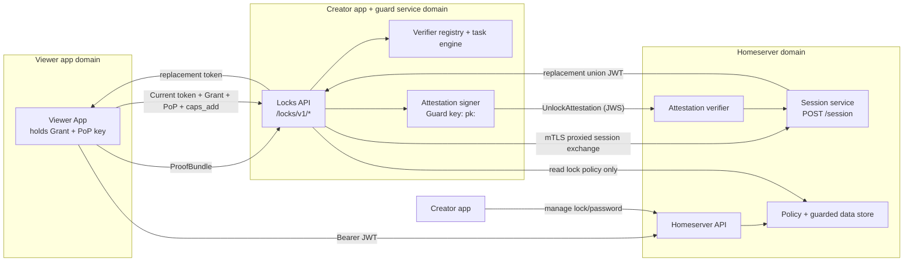

# Pubky Locks: JWT-Session Aligned Specification and Implementation Plan

**Version**: 0.2  
**Date**: April 2, 2026  
**Status**: Draft  
**Author**: John Carvalho / Synonym

---

## Auth Recap

| Artifact | Who signs | Key | Where private stored | Why/when |
|---|---|---|---|---|
| Grant | Ring/user | User key (Ed25519) | Ring secure store | Long-lived app auth + caps + `cnf` |
| PoP proof | Client app | PoP key (Ed25519) | Native keychain / WebCrypto / BFF | Every `POST /session` |
| Access JWT | Homeserver | Server key (Ed25519) | Server keystore/KMS | Short-lived bearer token |
| API request auth | None (app) | JWT only | N/A | Per-request auth; server checks `jti` session |

## 1. Doctrine

These rules govern design and implementation decisions for Locks v1.

1. **Locks verifies eligibility; homeserver mints access sessions.**
2. **Auth follows Grant + PoP + homeserver JWT sessions.**
3. **Wallets and external systems provide proofs; Locks evaluates them.**
4. **Guarded payloads live under `/guarded/`; discovery metadata stays public under `/pub/`.**
5. **MVP is authorization gating first; encrypted artifact delivery is deferred.**

---

## 2. What Locks Is

Locks is the authorization based gating layer for the Pubky ecosystem.

Creators define lock criteria for resources (payment, password, tag, and future proof types). Viewers satisfy criteria, then receive a **homeserver-issued replacement JWT** whose capabilities are the union of current session scopes and lock-authorized guarded-read scope.

Locks does not move funds and does not replace core authentication. It extends homeserver authorization with lock-aware verification and scope-union session extension.

### Product goals

- Monetize content and features without custody or protocol-level intermediaries.
- Keep locked resources discoverable via public previews and lock metadata.
- Support payment and non-payment criteria through a pluggable verifier model.
- Stay aligned with Pubky cold-key auth: Ring authorizes apps; homeserver runs sessions.
- Preserve credible exit: users keep identity control through keys and homeserver migration.

### Non-goals

Locks does not:

- Process or custody payments.
- Replace base homeserver auth/session infrastructure.
- Provide trustless enforcement or universal DRM.
- Require encrypted delivery in MVP.
- Require signed lock policies in v1.

---

## 3. Trust Model

Locks v1 uses the existing Pubky trust posture:

- **Two-party trust**: the homeserver stores guarded data and enforces capability checks; the guard service (co-located with the creator app domain) verifies criteria and issues attestations. Homeserver and guard operators may be distinct.
- **Guard attestation required**: homeserver only mints access JWTs after verifying a guard-signed attestation over the eligible unlock.
- **Service authentication**: guard and homeserver use mTLS for server-to-server calls; homeserver verifies guard signatures against the guard public key.
- **Cold key model remains intact**: Ring signs app Grants; routine requests use homeserver JWTs.
- **Credible exit preserved**: users can migrate homeservers via pkarr without losing identity.
- **No trustless claims**: this is not decentralized consensus authorization.

### Why this model

This design intentionally relies on the auth architecture where:

- A user-signed Grant is long-lived and reusable.
- A client proves possession (PoP) at session exchange.
- Homeserver issues short-lived JWT access tokens.
- Capabilities are enforced server-side via session records keyed by JWT `jti`.

Locks extends this by requesting a **session scope extension** only after lock criteria pass.

### 3.2 Roles and trust boundaries



---

## 4. Architecture

## 4.1 Components

### Creator app + guard service components (same domain)
- **Lock Policy Store Manager**: manager of homeserver-stored lock policy objects (unsigned in v1).
- **Lock Guard Service**: verifies proofs and orchestrates unlock tasks.
- **Verifier Registry**: payment/password/tag/oracle adapters (plugins).
- **Unlock Task Engine**: async-first processing and polling.
- **Session Extension Proxy**: forwards session extension request to homeserver `/session` using current session, Grant + PoP, and guard attestation.
- **Attestation Signer**: guard signs unlock attestations with its own long-term key.

### Homeservice components
- **Homeserver Session Service**: verifies Grant/PoP and mints JWT.
- **Attestation Verifier**: validates guard signatures and attestation scope.
- **Policy and password store**: homeserver owns policy writes and password material.

## 4.2 Two-layer model

**Layer A: Authorization core (MVP)**

- Lock policies
- Proof verification
- Async unlock tasks
- JWT scope-union session extension
- Guarded path enforcement

**Layer B: Confidential delivery (deferred)**

- Encrypted payload artifacts
- Key delivery envelopes
- Key rotation/regression

Layer B must not block Layer A delivery.

## 4.3 Canonical flow (async-first)

```
1. Creator publishes public preview metadata and lock metadata under /pub/.
2. Creator stores guarded payload under /guarded/.
3. Viewer discovers preview + lock signal (via /events endpoint).
4. Viewer obtains required proof ids (payment/password/tag/oracle ref).
5. Viewer creates unlock task: POST <creator-guard-origin>/locks/v1/unlock_requests with proof ids.
6. Guard service verifies criteria asynchronously (including polling external proof sources if needed).
7. Viewer polls unlock task status.
8. When task is eligible, viewer submits current token + Grant + fresh PoP to POST <creator-guard-origin>/locks/v1/unlock_requests/{task_id}/token.
9. Guard service signs an UnlockAttestation and proxies POST /session with current token + Grant + PoP + attestation + additive capability.
10. Homeserver verifies attestation (mTLS + guard signature), unions scopes, revokes old session, returns replacement access JWT; guard forwards it to viewer.
11. Viewer reads guarded payload with Authorization: Bearer <jwt>.
```

---

## 5. Data and Path Model

Locks v1 standardizes a practical split:

| Data class | Path | Visibility |
|------------|------|------------|
| Lock signal + preview metadata | `/pub/...` | Public |
| Lock policy object | `/pub/.../locks/policies/...` | Public |
| Guarded payload | `/guarded/...` | JWT-scoped read |
| Audit and operational records | homeserver internal DB | Private |
| Password material | homeserver internal DB | Private |

### Design rationale

- `/pub/` remains fully discoverable and indexable.
- `/guarded/` avoids mixed public/guarded behavior in the same object path.
- Feed and indexer integrations can continue using public metadata while deferring guarded reads to client-authenticated fetches.

### Design trade offs
- User will need to provide preview material for each app separately

---

## 6. Core Objects

## 6.1 LockPolicy (v1 unsigned)

v1 policies are homeserver-managed objects. They are not creator-signed in MVP.

| Field | Type | Required | Description |
|-------|------|----------|-------------|
| `v` | integer | yes | Schema version (`1`) |
| `lock_id` | string | yes | Unique lock identifier |
| `creator` | string | yes | Creator pubky (`pk:<z32>`) |
| `resource_preview` | string | yes | Public preview URI (`pubky://<z32>/pub/...`) |
| `resource_guarded` | string | yes | Guarded payload URI (`pubky://<z32>/guarded/...`) |
| `criteria` | array | yes | Criteria list |
| `logic` | object | yes | `ANY` / `ALL` logic tree |
| `token_ttl_sec` | integer | yes | Access JWT target TTL for this lock |
| `token_scope` | string | yes | Additive scope policy (`single_resource_read` in v1) |
| `guard_service_id` | string | yes | Guard identity (`pk:<z32>` or app id) |
| `guard_service_url` | string | yes | Guard API origin (`https://...`), co-located with creator app domain in this model |
| `preview` | object | no | Public lock preview metadata |
| `created_at` | integer | yes | Unix timestamp |
| `updated_at` | integer | yes | Unix timestamp |
| `expires_at` | integer | no | Lock expiration |

## 6.2 ProofBundle

Viewer-submitted proofs for an unlock attempt.

| Field | Type | Required | Description |
|-------|------|----------|-------------|
| `v` | integer | yes | `1` |
| `lock_id` | string | yes | Target lock |
| `viewer` | string | yes | Viewer pubky |
| `proofs` | array | yes | Proofs or proof references |
| `client_time` | integer | yes | Viewer timestamp |

`proofs[]` may include either:

- **Inline proofs** (receipt/challenge response/tag credential)
- **Proof references** (`ref_uri`, oracle id, external transaction reference)

## 6.3 UnlockTask

Asynchronous verification state.

| Field | Type | Required | Description |
|-------|------|----------|-------------|
| `task_id` | string | yes | Unlock task id |
| `lock_id` | string | yes | Lock being evaluated |
| `viewer` | string | yes | Viewer pubky |
| `status` | string | yes | `pending` `verifying` `eligible` `failed` `expired` |
| `failed_criteria` | array | no | Per-criterion failures |
| `passed_criteria` | array | no | Passed criterion ids |
| `created_at` | integer | yes | Unix timestamp |
| `updated_at` | integer | yes | Unix timestamp |
| `expires_at` | integer | yes | Task expiry |

## 6.4 UnlockTokenResponse


Returned after successful token exchange for an eligible task.

| Field | Type | Required | Description |
|-------|------|----------|-------------|
| `status` | string | yes | `ok` |
| `token` | string | yes | Homeserver JWT access token |
| `session` | object | yes | Session metadata from homeserver |
| `replaced_session_jti` | string | yes | Prior session revoked by replacement |
| `task_id` | string | yes | Source unlock task |

The `session` object follows the homeserver session response model and includes `grant_id`, `token_expires_at`, and effective capabilities.

## 6.5 UnlockAttestation

Guard-signed proof that a specific unlock task is eligible.

| Field | Type | Required | Description |
|-------|------|----------|-------------|
| `v` | integer | yes | `1` |
| `attestation_id` | string | yes | Unique attestation id |
| `task_id` | string | yes | Unlock task id |
| `lock_id` | string | yes | Lock id |
| `viewer` | string | yes | Viewer pubky |
| `resource_guarded` | string | yes | Guarded resource URI |
| `base_session_jti` | string | yes | JWT session being extended |
| `caps_add` | array | yes | Additive capabilities requested |
| `issued_at` | integer | yes | Unix timestamp |
| `expires_at` | integer | yes | Attestation expiry |
| `guard_issuer` | string | yes | Guard service public key (`pk:<z32>`) |
| `sig` | string | yes | Guard signature over canonical form |

## 6.6 UnlockAttestation JWS profile (minimal v1)

UnlockAttestation is transported as compact JWS (`base64url(header).base64url(payload).base64url(sig)`).

**Header:**
```json
{
  "alg": "EdDSA",
  "typ": "pubky-locks-attestation"
}
```

**Payload:**
```json
{
  "iss": "pk:<guard_z32>",
  "aud": "pk:<homeserver_z32>",
  "jti": "<attestation_id>",
  "iat": 1769500000,
  "exp": 1769500030,
  "lock_id": "<lock_id>",
  "task_id": "<task_id>",
  "viewer": "pk:<viewer_z32>",
  "resource_guarded": "pubky://<creator_z32>/guarded/<app-id>/posts/<id>/payload.json",
  "base_session_jti": "<current_jti>",
  "caps_add": ["/guarded/<app-id>/posts/<id>/payload.json:r"],
  "result": "eligible"
}
```

**Validation rules (homeserver):**

- Verify mTLS peer identity for guard-to-homeserver channel.
- Verify JWS signature against configured guard public key.
- `iss` MUST match policy `guard_service_id`.
- `aud` MUST equal homeserver public key.
- `exp - iat` MUST be `<= 30` seconds.
- `result` MUST be `eligible`.
- `base_session_jti` MUST match the session referenced by the presented current token.
- `caps_add` MUST exactly match token extension request scope.
- Resulting `caps_out = caps_base UNION caps_add` MUST remain subset of Grant caps.
- `jti` MUST be one-time-use (replay rejected).

---

## 7. JWT Session Integration for Locks

Locks uses the Grant + PoP + JWT architecture as follows.

## 7.1 Viewer prerequisites

Viewer client must hold:

- A valid user-signed Grant (with `cnf` key binding).
- The corresponding PoP private key.

## 7.2 Scope-union session exchange

When an unlock task reaches `eligible`, Locks requests a token through the homeserver session endpoint by proxying:

- `current_token`: viewer's current homeserver JWT
- `grant`: user Grant
- `pop_proof`: fresh PoP proof for target homeserver
- `caps_add`: requested additive capabilities
- `attestation`: guard-signed UnlockAttestation

Homeserver verifies attestation signature and enforces mTLS-authenticated guard identity.
Guard service credentials are service-only and MUST NOT be reused as viewer capabilities.
Attestation format and validation are defined in **6.6**.

### Scope-union rules (mandatory)

`caps_base` is taken from the active session identified by `current_token`.

- Compute `caps_out = caps_base UNION caps_add`.
- If `caps_out` exceeds Grant capabilities: reject with `UNION_NOT_IN_GRANT`.
- If valid: homeserver mints replacement JWT/session with `caps_out` and revokes prior session.
- Operation is idempotent on `(base_session_jti, task_id)`; retries return the same replacement token/session state.

## 7.3 v1 additive scope

v1 Locks adds only `single_resource_read` guarded scope.

Canonical capability shape:

```
/guarded/<app-id>/<resource-path>:r
```

No write access and no wildcard expansion beyond the target resource path.

## 7.4 Token lifecycle

- JWT lifetime is short/medium and defined by homeserver policy (Locks `token_ttl_sec` is an input target, capped by homeserver constraints).
- Revocation follows homeserver session revocation semantics.
- Session extension replaces the prior token immediately.
- App refresh uses normal `/session` exchange with fresh PoP.

---

## 8. Criteria and Verification Model

## 8.1 v1 criteria

- Payment
- Password (challenge-response)

v2+ extends with tag credentials, crowdwall, oracle-backed checks.

## 8.2 Async verifier execution

Unlock processing is async-first because some proofs are not immediately verifiable.

Examples:

- Poll payment backend by reference id.
- Poll third-party oracle/public API.
- Wait for external confirmation depth.

## 8.3 Idempotency

Unlock task creation uses idempotency keys to avoid duplicate work and duplicate payment handling.

For payment criteria, repeated submissions of equivalent proof should return the same active unlock state/result instead of creating new charges or duplicated processing.

---

## 9. Guarded Access Semantics

Guarded content is served from `/guarded/...` and requires JWT authorization.

Request:

```
GET /guarded/<app-id>/posts/<id>/payload.json
Authorization: Bearer <jwt>
```

Denied access behavior is unified:

- Always return `403 Forbidden` when token is missing/invalid/expired/insufficient.
- Include lock policy hint header:

```
Link: <policy-uri>; rel="lock-policy"
```

No `402` split in v1.

Unlock behavior on guard failure:

- New unlocks fail closed when guard is unavailable.
- Existing JWTs remain valid until expiry.

---

## 10. API

Lock guard endpoints are served from the creator app/guard service origin under `/locks/v1/*`.
Homeserver management endpoints remain on the homeserver origin.

## 10.1 Get policy (guard service)

```
GET <creator-guard-origin>/locks/v1/policy?resource=<pubky-uri>
```

Responses:

- `200` policy JSON
- `404` no lock for resource
- `410` lock/resource removed

## 10.2 Password challenge (guard service)

```
GET <creator-guard-origin>/locks/v1/challenge?lock_id=<lock_id>
```

Response:

```json
{
  "nonce": "<base64url>",
  "salt": "<base64url>",
  "expires_at": 1769500300
}
```

## 10.3 Create unlock request (guard service)

```
POST <creator-guard-origin>/locks/v1/unlock_requests
Content-Type: application/json

{
  "proof_bundle": { ... },
  "idempotency_key": "<optional>"
}
```

Response:

```json
{
  "status": "accepted",
  "task_id": "...",
  "state": "pending"
}
```

## 10.4 Poll unlock request (guard service)

```
GET <creator-guard-origin>/locks/v1/unlock_requests/<task_id>
```

Response includes task state and criterion evaluation progress.

## 10.5 Exchange eligible task for token (guard service)

```
POST <creator-guard-origin>/locks/v1/unlock_requests/<task_id>/token
Content-Type: application/json

{
  "current_token": "<jwt>",
  "grant": "<jws>",
  "pop_proof": "<jws>",
  "caps_add": ["/guarded/<app-id>/posts/<id>/payload.json:r"]
}
```

Behavior:

1. Validate task is `eligible` and not expired.
2. Validate `caps_add` matches lock target scope.
3. Issue UnlockAttestation signed by guard key.
4. Proxy to homeserver `POST /session` with current token + Grant + PoP + attestation.
5. Homeserver unions scopes, revokes prior session, and returns replacement JWT/session payload.
6. Return replacement JWT/session payload.

The attestation is created and transmitted only on the guard-to-homeserver hop; the viewer does not submit it directly.

## 10.6 Creator management endpoints (homeserver)

Authenticated creator session required.

Create/update lock policy:

```
PUT <homeserver-origin>/locks/v1/manage
```

Remove lock:

```
DELETE <homeserver-origin>/locks/v1/manage?lock_id=<lock_id>
```

Set password:

```
POST <homeserver-origin>/locks/v1/manage/password
```

---

## 11. Error Model

## 11.1 Unlock task errors

| Code | Meaning |
|------|---------|
| `POLICY_NOT_FOUND` | Resource has no active lock |
| `POLICY_EXPIRED` | Lock policy expired |
| `VERIFICATION_FAILED` | Criteria not satisfied |
| `TASK_EXPIRED` | Unlock task expired before completion |
| `SESSION_NOT_FOUND` | Referenced base session does not exist |
| `SESSION_SUBJECT_MISMATCH` | Base session subject does not match unlock viewer |
| `UNION_SCOPE_INVALID` | Requested additive scope is malformed or lock-mismatched |
| `UNION_NOT_IN_GRANT` | Union of base and additive scopes exceeds Grant capabilities |
| `ATTESTATION_INVALID` | Guard attestation invalid or mismatched |
| `ATTESTATION_EXPIRED` | Guard attestation expired |
| `ATTESTATION_REPLAY` | Attestation `jti` already used |
| `GUARD_AUTH_FAILED` | Guard to homeserver authentication failed |
| `GUARD_UNAVAILABLE` | Guard service unreachable |
| `GRANT_REVOKED` | Grant revoked at homeserver |
| `GRANT_EXPIRED` | Grant expired |
| `POP_INVALID` | PoP verification failed |
| `RATE_LIMITED` | Request throttled |
| `INTERNAL_ERROR` | Internal server failure |

## 11.2 Guarded resource access

- `200` authorized and served
- `403` unauthorized for any reason (missing, invalid, expired, or insufficient token)

---

## 12. Discovery and Indexing

Locked resources remain visible through public metadata.

Resource metadata lock signal example:

```json
{
  "lock": {
    "lock_id": "<lock_id>",
    "types": ["payment"],
    "amount": "50000",
    "asset": "BTC",
    "policy_uri": "pubky://<z32>/pub/<app-id>/locks/policies/<lock_id>.json",
    "guarded_uri": "pubky://<z32>/guarded/<app-id>/posts/<id>/payload.json",
    "guard_service_id": "pk:<z32>",
    "guard_service_url": "https://locks.example.com"
  }
}
```

Indexers may index lock presence/type/price metadata but must not index submitted proofs, Grants, PoP proofs, or JWT session details.

---

## 13. UX Model

## 13.1 Viewer experience

- Feeds show rich previews and lock indicators from `/pub/` metadata.
- Unlock starts in-app and is async-capable for long-running verification.
- On success, app receives JWT and fetches guarded payload immediately.
- If JWT expires, app refreshes through normal Grant + PoP session exchange.

## 13.2 Creator experience

Recommended creation sequence:

1. Create lock policy first.
2. Publish preview metadata and lock signal.
3. Publish guarded payload under `/guarded/`.

This avoids temporary public exposure windows for content intended to be locked.

## 13.3 Zero-interaction direction (post-MVP)

MVP can ship with explicit unlock actions. Longer-term UX target is minimal interaction unlock where clients can proactively satisfy proofs and cache scoped sessions while preserving privacy constraints.

---

## 14. Homeserver Migration and Exit

This architecture keeps migration practical:

- Lock policy objects are data and can be migrated with creator state.
- JWT sessions are homeserver-local and naturally re-established after migration.
- Viewer keeps Grant + PoP key and can exchange on the new homeserver.

No lock-specific key delegation chain is required in v1.

Guard services are independently addressable by `guard_service_id` and `guard_service_url` and can be swapped without changing homeserver identity, as long as policies are updated to point to the new guard.

---

## 15. Implementation Plan

## Deliverable 1: Protocol update (2 weeks)

- Freeze unsigned `LockPolicy` v1 schema.
- Freeze `UnlockTask` and async status model.
- Freeze `/locks/v1` API routes.
- Freeze scope-union contract (`caps_base UNION caps_add`, Grant-bound check, replacement semantics, idempotency keying).

Exit criteria: spec stable, examples and test vectors for union checks and async state transitions.

## Deliverable 2: Homeserver lock guard service (3 weeks)

- Implement verifier registry and async unlock task engine.
- Implement `/locks/v1/unlock_requests` lifecycle.
- Implement `/locks/v1/unlock_requests/{task_id}/token` proxy to `/session` with session-union semantics.
- Implement guarded `/guarded/*` authorization checks using JWT capabilities.

Exit criteria: end-to-end unlock to guarded read works with replacement union JWT.

## Deliverable 3: App integration (3 weeks)

- Integrate async unlock polling UX.
- Add Grant + PoP handoff for token exchange.
- Add JWT cache/refresh handling for guarded reads.
- Keep feed rendering from public preview metadata.

Exit criteria: viewer unlocks and reads guarded payload in one flow with no manual token handling.

## Deliverable 4: Wallet/proof adapters (2 weeks)

- Payment proof adapter(s) for current wallet flow.
- Proof-reference polling adapter for external systems.
- Idempotent unlock handling for duplicate payment submissions.

Exit criteria: payment unlock is stable under retries and server restarts.

## Deliverable 5: Indexer and feed compatibility (1 week)

- Confirm lock metadata indexing behavior.
- Confirm locked-preview rendering consistency.
- Confirm no guarded payload leakage in index pipelines.

Exit criteria: locked items are discoverable; guarded payload stays protected.

---

## 16. Open Questions

1. **Union extension syntax**: confirm final `caps_add` encoding and `/session` extension mode compatibility.
2. **Async orchestration limits**: define timeout and retry strategy per verifier type.
3. **Oracle adapters**: standardize proof-reference schema for external public APIs.
4. **TTL policy bounds**: define min/max `token_ttl_sec` for anti-abuse and UX stability.
5. **Feed auto-unlock privacy model**: evaluate privacy-preserving prefetch/auto-unlock patterns before implementation.

---

## 17. Summary of v0.2 Changes

- Replaced `UnlockGrant` model with homeserver JWT sessions.
- Moved lock APIs to `/locks/v1/*`.
- Made unlock verification async-first with task polling.
- Standardized guarded payload path under `/guarded/*`.
- Simplified v1 policies to unsigned homeserver-managed objects.
- Unified unauthorized guarded reads under `403`.
- Added mandatory JWT scope-union extension rule for lock-issued replacement access tokens.
